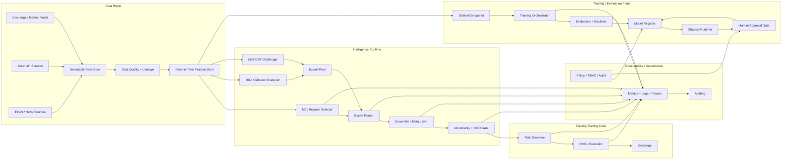
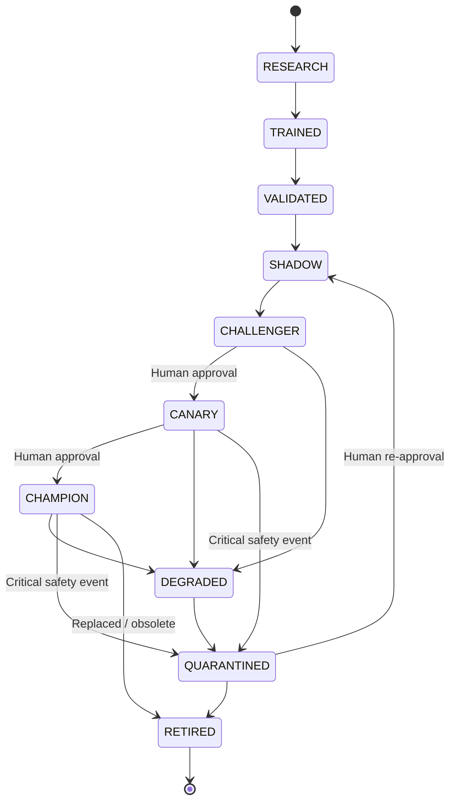

# Spesifikasi Developer Bot Trade Platform v1.1.0 — Adaptive Multi-Model Intelligence

## Ringkasan Eksekutif

**Bot Trade Platform v1.1.0** sebaiknya diperlakukan sebagai **rilis fondasi intelligence orchestration**, bukan sebagai rilis yang mencoba memasukkan sebanyak mungkin model AI. Target utamanya adalah membuat pipeline yang mampu menjalankan banyak model secara konsisten, memilih expert sesuai kondisi pasar, mengetahui kapan prediksi tidak dapat dipercaya, mengevaluasi challenger secara otomatis, dan menghentikan model yang memburuk—tanpa memberikan hak kepada agent/model untuk mempromosikan dirinya sendiri ke production.

Arsitektur yang direkomendasikan adalah:

\[
\text{Data}
\rightarrow
\text{Feature Store}
\rightarrow
\text{Regime}
\rightarrow
\text{Experts}
\rightarrow
\text{Router}
\rightarrow
\text{Ensemble}
\rightarrow
\text{Uncertainty/OOD}
\rightarrow
\text{Risk}
\rightarrow
\text{OMS}
\]

dengan plane terpisah untuk:

\[
\text{Training}
\rightarrow
\text{Evaluation}
\rightarrow
\text{Registry}
\rightarrow
\text{Shadow}
\rightarrow
\text{Human Approval}
\rightarrow
\text{Production}
\]

Pemilihan desain ini sengaja konservatif. Time-series finansial mengalami distribution shift dan dependensi temporal, sehingga model yang bagus pada satu periode belum tentu tetap valid pada periode berikutnya; bahkan conformal prediction standar tidak boleh diperlakukan seolah-olah memiliki jaminan i.i.d. biasa pada data temporal. Adaptive/online conformal dan drift monitoring lebih cocok untuk konteks ini. citeturn17view0turn16academia40turn16academia42

Untuk **v1.1.0**, model minimum yang direkomendasikan hanya tiga:

| ID | Model | Status awal | Fungsi |
|---|---|---|---|
| `M01` | Gaussian HMM + safety overrides | Production context | Regime detector |
| `M02` | Existing XGBoost | Champion | Alpha/meta-classification yang sudah ada |
| `M03` | Cross-Asset GAT | Shadow Challenger | Eksperimen relasi antar-aset |

GAT dipilih sebagai challenger, bukan karena telah terbukti universal untuk crypto, melainkan karena graph architecture secara alami dapat memodelkan dependensi dinamis antar-aset. Literatur 2024–2025 di pasar ekuitas memberi bukti awal bahwa dynamic financial graphs layak diteliti, sementara PyTorch Geometric sudah menyediakan implementasi `GATConv` dengan multi-head attention, dropout, self-loop dan edge features. Itu adalah **alasan penelitian**, bukan bukti bahwa GAT pasti menghasilkan alpha crypto. citeturn13academia39turn13academia38turn19view3

Prinsip normatif dokumen ini:

- **WAJIB** berarti agent/developer tidak boleh menyimpang tanpa perubahan spesifikasi.
- **SEBAIKNYA** berarti default kuat yang boleh diganti dengan bukti evaluasi.
- **DILARANG** berarti perubahan tersebut harus ditolak oleh CI/CD atau governance layer.
- Semua threshold numerik di bawah adalah **baseline awal v1.1.0**, bukan konstanta pasar universal. Threshold ekonomi yang tergantung venue, timeframe, modal, dan fee harus tetap configurable karena **exact exchange, compute budget, horizon trading, dan infrastructure budget tidak ditentukan**.

Keputusan arsitektural terpenting adalah: **model boleh otomatis gagal, di-quarantine, dan kehilangan weight; model tidak boleh otomatis mendapatkan lebih banyak otoritas atau modal.**

## Arsitektur dan Batas Sistem

### Arsitektur target



Pemisahan `runtime plane` dari `training/evaluation plane` adalah requirement utama. Agent yang dapat melakukan training **tidak boleh** memiliki jalur langsung ke production deployment atau exchange credentials. Model Registry menjadi sumber kebenaran untuk versi, lineage, aliases, tags, artifacts dan status lifecycle. Konsep ini konsisten dengan model registry modern seperti MLflow, yang menyediakan versioning, lineage, aliases seperti `champion`, metadata dan governance. citeturn18view0

Risk Governor dan OMS dari sistem sekarang harus tetap **downstream authority**. Intelligence layer hanya menghasilkan sesuatu seperti:

```text
desired_action
expected_edge
calibrated_probability
uncertainty
model_evidence
regime
abstain_reason
```

bukan:

```text
send_order_directly()
change_max_position()
disable_stop_loss()
modify_risk_policy()
```

Dengan demikian:

\[
\text{AI authority} < \text{Risk authority} < \text{Execution constraints}
\]

### Komponen dan tanggung jawab

| Komponen | Tanggung jawab | Dilarang |
|---|---|---|
| Market Data Connector | Mengambil OHLCV, trades, L1/L2, timestamps, sequence IDs | Menghasilkan feature dengan future data |
| Immutable Raw Store | Menyimpan event mentah, replayable | Overwrite history tanpa revision |
| Data Quality Service | Gap, duplicate, stale, crossed book, timestamp validation | Silent repair data kritis |
| Feature Store | Point-in-time feature materialization | Menggunakan data yang belum tersedia saat keputusan |
| `M01 Regime Service` | Menghasilkan posterior regime | Mengambil keputusan trading langsung |
| Expert Runtime | Menjalankan setiap model di contract yang seragam | Mengubah schema runtime sendiri |
| Expert Router | Hard gating dan dynamic weights | Meloloskan quarantined model |
| Ensemble Layer | Menggabungkan expert outputs | Menggunakan in-sample prediction untuk meta training |
| UQ/OOD Gate | Interval, drift, OOD, abstention | Menurunkan threshold sendiri |
| Model Registry | Version, lineage, state, artifacts, aliases | Menerima artifact tanpa checksum/provenance |
| Training Orchestrator | Reproducible training jobs | Production promotion |
| Backtest Simulator | Event-driven execution simulation | `touch == fill` assumption untuk limit order |
| Evaluation Service | Statistical/financial/operational gates | Mengubah gate untuk “menyelamatkan” model |
| Shadow Runtime | Real live inputs tanpa live capital | Mengirim production order |
| Governance Service | Approval, RBAC, signed decisions | Auto-approval oleh training agent |
| Telemetry | Metrics, traces, logs, audit | Menyimpan secret dalam log |
| Risk Governor | Position/exposure/drawdown/kill switch | Dikendalikan model |
| OMS | Order state, retries, reconciliation | Mengabaikan venue rules |

Observability harus meliputi **metrics, logs, dan traces**, bukan hanya dashboard PnL; OpenTelemetry mendefinisikan ketiganya sebagai sinyal inti untuk memahami sistem dan men-debug perilaku distributed services. citeturn19view0

### Boundary v1.1.0

**In-scope:**

```text
Feature contracts
Model registry
Regime detection
Expert interface
Router
Ensemble
Calibration
Uncertainty
OOD/drift
Shadow
Lifecycle
Training/evaluation APIs
Backtest improvements
Telemetry
Governance
```

**Out-of-scope atau schema-ready saja:**

```text
Full production DeepLOB
RL execution
Autonomous strategy generation
LLM-driven trading
Automatic model self-promotion
Automatic capital scaling
Fully automated hyperparameter-to-production pipeline
```

L2, on-chain, dan event data harus sudah mempunyai schema, tetapi v1.1.0 tidak harus menunggu semua sumber tersebut tersedia.

## Kontrak Data, Feature Store, Model Registry, dan Interface Model

### Prinsip data point-in-time

Kolom yang paling penting bukan hanya `event_time`, tetapi juga:

```text
event_time
available_at
ingested_at
```

Contoh: berita mungkin memiliki `published_at=10:00:00`, tetapi sistem baru menerimanya `10:00:04.213`. Backtest pada `10:00:02` **tidak boleh** menganggap berita tersebut sudah diketahui.

Setiap derived feature harus memenuhi:

\[
available\_at(feature) \le decision\_time
\]

dan semua parent lineage feature harus dapat direkonstruksi.

Untuk L2, simulator harus menghormati sifat venue-specific seperti incremental depth updates, sequence/order-book reconstruction dan cadence pesan. Sebagai contoh konkret—bukan pilihan exchange untuk bot ini—dokumentasi Binance 2026 menunjukkan incremental depth 20 ms dan top-20 snapshots 50 ms, sekaligus membedakan `eventTime` dan mekanisme stream. Ini menunjukkan mengapa backtest microstructure tidak boleh menganggap market feed sebagai snapshot kontinu tanpa latency atau message semantics. citeturn18view4

### Schema data inti

| Dataset | Status v1.1 | Key fields |
|---|---|---|
| OHLCV | **WAJIB** | venue, symbol, timeframe, open/close time, OHLC, base/quote volume, trades |
| Trades | SEBAIKNYA | event time, receive time, trade ID, price, qty, aggressor |
| L2 | Schema WAJIB; data opsional | sequence/update ID, price levels, qty, snapshot/update |
| Cross-asset | **WAJIB untuk M03** | universe version, asset returns, vol, correlations |
| On-chain | Opsional | chain, block, block time, finality, entity, metric |
| Events/news | Opsional | source, published/first-seen, assets, type, confidence |
| Derived features | **WAJIB** | `as_of`, feature set version, lineage, available_at |

**OHLCV record:**

```yaml
venue: "tidak_ditentukan"
symbol: BTC-QUOTE
timeframe: 1h

open_time: "2026-09-01T00:00:00Z"
close_time: "2026-09-01T01:00:00Z"
available_at: "2026-09-01T01:00:00.350Z"
ingested_at: "2026-09-01T01:00:00.410Z"

open: 100000.0
high: 101200.0
low: 99700.0
close: 100900.0
base_volume: 123.45
quote_volume: 12400000.0
trade_count: 18420

is_final: true
source_revision: 0
quality_flags: []
```

**L2 event:**

```yaml
venue: "tidak_ditentukan"
symbol: BTC-QUOTE
event_time: "2026-09-01T01:00:00.123456Z"
received_at: "2026-09-01T01:00:00.147321Z"

sequence_id: 928177291
update_type: incremental

bids:
  - [100899.0, 0.73]
  - [100898.0, 2.10]

asks:
  - [100900.0, 0.44]
  - [100901.0, 1.31]

quality:
  sequence_gap: false
  crossed_book: false
```

**On-chain:**

```yaml
chain: ethereum
block_number: 12345678
block_hash: "..."
block_time: "..."
available_at: "..."
finality_status: finalized

entity: exchange_cluster_x
metric: net_exchange_flow
value: 1820.44
unit: ETH

source_version: v3
```

**Event/news:**

```yaml
event_id: evt_01...
published_at: "..."
first_seen_at: "..."
ingested_at: "..."

source: provider_x
event_type: regulatory
assets: [BTC, ETH]

sentiment: -0.62
novelty: 0.88
source_confidence: 0.94
extraction_confidence: 0.91

dedup_hash: "sha256:..."
extractor_version: event_encoder_1.4.2
```

Pada v1.4, LLM boleh menjadi extractor untuk menghasilkan record semacam ini; teks LLM **tidak boleh langsung menjadi `BUY/SELL`**.

### Feature Store schema

Logical primary key:

```text
(entity_id, feature_time, feature_set_version)
```

Metadata minimum:

```yaml
feature_time: timestamp
available_at: timestamp
ingested_at: timestamp

entity_type: asset
entity_id: BTC
venue: "tidak_ditentukan"

feature_set: core_market_v1
feature_set_version: 1.1.0

values:
  return_1: 0.0032
  return_4: 0.0087
  realized_vol_24: 0.021
  volume_z_24: 1.32

lineage:
  dataset_snapshot_id: ds_...
  source_range_hash: sha256:...
  transform_git_sha: ...
  transform_config_hash: ...

quality:
  stale: false
  missing_fraction: 0.0
```

**DILARANG** melakukan implicit inference-time imputation yang berbeda dari preprocessing pipeline saat training. Imputer, scaler, encoder dan winsorization rules adalah bagian dari artifact model/version.

### Model Registry

Implementasi boleh memakai MLflow atau registry internal. Yang penting adalah konsepnya: immutable model versions, lineage, tags, metadata, aliases dan controlled promotion. MLflow secara eksplisit menyediakan versioning, lineage, aliases seperti `champion`, serta tags seperti validation status. citeturn18view0

Semua registry record **WAJIB** tervalidasi terhadap JSON Schema atau validator ekuivalen; JSON Schema menyediakan standar formal untuk mendeskripsikan dan memvalidasi struktur dokumen JSON. citeturn3view3

Contoh model manifest:

```yaml
apiVersion: bottrade.ai/v1
kind: ModelVersion

metadata:
  model_id: m03_cross_asset_gat
  version: 0.4.0
  owner: quant-research
  created_at: "2026-09-26T04:30:00Z"

identity:
  task: cross_asset_alpha
  family: graph_attention_network
  lifecycle_state: SHADOW
  alias: null

contract:
  version: "1.0"
  input_schema: "feature://cross_asset_core/1.1.0"
  output_schema: "model-output://alpha-prediction/1.0"

data:
  dataset_id: crypto_market_snapshot
  dataset_version: "2026-09-20"
  content_hash: "sha256:..."
  universe_version: "liquid_assets_v7"
  feature_set_version: "cross_asset_core_1.1.0"

code:
  git_sha: "abc123..."
  training_entrypoint: "models.gat.train"
  environment_lock_hash: "sha256:..."

artifact:
  format: pytorch_state_dict
  uri: "artifact://models/m03/0.4.0"
  sha256: "..."
  signature_sha256: "..."

training:
  seeds: [104729, 130363, 155921]
  framework: pytorch
  framework_version: "recorded_at_build"
  device: "not_specified"
  hyperparameters_hash: "sha256:..."

evaluation:
  evaluation_id: eval_...
  backtest_config_id: sim_...
  status: PASSED_OFFLINE
  evaluated_at: "..."

calibration:
  method: sigmoid
  calibration_dataset_id: calib_...

uncertainty:
  method: adaptive_conformal
  nominal_coverage: 0.90
  state_artifact: "artifact://..."

ood:
  detector_version: ood_core_v1
  reference_dataset_id: ref_...

routing:
  compatible_regimes:
    - TREND_UP
    - TREND_DOWN
    - RANGE
  max_weight: 0.70

governance:
  production_approved: false
  approved_by: null
  approval_id: null
```

### Model contract

Agent harus mengimplementasikan semua expert di balik contract yang sama.

Contoh Python protocol:

```python
from dataclasses import dataclass
from datetime import datetime
from enum import Enum
from typing import Mapping, Protocol, Sequence


class PredictionStatus(str, Enum):
    OK = "OK"
    ABSTAIN_OOD = "ABSTAIN_OOD"
    ABSTAIN_UNCERTAIN = "ABSTAIN_UNCERTAIN"
    STALE_INPUT = "STALE_INPUT"
    INVALID_INPUT = "INVALID_INPUT"
    TIMEOUT = "TIMEOUT"
    INTERNAL_ERROR = "INTERNAL_ERROR"


@dataclass(frozen=True)
class ModelContext:
    decision_time: datetime
    venue: str
    symbol: str
    timeframe: str
    feature_schema_version: str
    dataset_fingerprint: str
    regime_probabilities: Mapping[str, float]


@dataclass(frozen=True)
class PredictionResult:
    model_id: str
    model_version: str
    status: PredictionStatus

    target_horizon: str

    # Common normalized alpha representation
    alpha_score: float | None
    calibrated_probability: float | None
    expected_return_bps: float | None

    # Optional uncertainty outputs
    quantile_p10_bps: float | None
    quantile_p50_bps: float | None
    quantile_p90_bps: float | None
    conformal_lower_bps: float | None
    conformal_upper_bps: float | None

    uncertainty_score: float | None
    ood_score: float | None

    input_fingerprint: str
    inference_started_at: datetime
    inference_finished_at: datetime

    warnings: Sequence[str]


class TradingExpert(Protocol):
    def predict(
        self,
        context: ModelContext,
        features: Mapping[str, float],
    ) -> PredictionResult:
        ...
```

Tidak semua expert harus menyediakan semua field. Registry harus memuat capability flags:

```yaml
capabilities:
  probability: true
  expected_return: true
  quantiles: false
  conformal_interval: true
  cross_asset: true
```

**Error policy harus fail-closed.**

| Kondisi | Runtime response | Trading consequence |
|---|---|---|
| Feature schema mismatch | `INVALID_INPUT` | weight = 0 |
| Critical NaN/Inf | `INVALID_INPUT` | weight = 0 |
| Stale critical feature | `STALE_INPUT` | weight = 0 |
| OOD hard threshold | `ABSTAIN_OOD` | weight = 0 |
| Uncertainty terlalu tinggi | `ABSTAIN_UNCERTAIN` | weight = 0 |
| Model timeout | `TIMEOUT` | router renormalize |
| Artifact checksum mismatch | service refuses load | quarantine |
| Model exception | `INTERNAL_ERROR` | weight = 0 + alert |
| Tidak ada valid expert | `NO_QUORUM` | **NO TRADE** |

Tidak boleh ada logic:

```python
try:
    ...
except Exception:
    return previous_prediction
```

kecuali previous prediction secara eksplisit masih valid untuk keputusan sekarang—yang untuk signal trading umumnya tidak boleh diasumsikan.

## Intelligence Plane: Regime, Router, Ensemble, Uncertainty, dan OOD

### Regime detector

`M01` bukan directional trading model. Tugasnya adalah memperkirakan:

\[
P(R_t=r\mid X_{1:t})
\]

dengan semantic regime awal:

```text
TREND_UP
TREND_DOWN
RANGE
HIGH_VOL_SHOCK
TRANSITION_UNKNOWN
```

Arsitektur v1.1.0 sebaiknya **hybrid**:

```text
Gaussian HMM
     +
Semantic State Mapper
     +
Hysteresis
     +
Safety Override
     +
Sequential Drift Alarm
```

HMM menghasilkan latent states dan posterior; semantic mapper menerjemahkan latent state menjadi label manusia. Untuk jumlah state, gunakan candidate \(K \in \{4,5,6\}\), beberapa random initialization, lalu pilih berdasarkan BIC/AIC, stability dan minimum state occupancy. Dokumentasi `hmmlearn` juga mencontohkan pemilihan jumlah state dengan AIC/BIC dan multiple random initializations, karena training likelihood sendiri cenderung meningkat saat model dibuat lebih kompleks. citeturn17view1

**Feature regime awal:**

| Kelompok | Feature |
|---|---|
| Return | `return_1`, `return_4`, `return_24`, `return_72` |
| Volatility | realized vol 24/72, downside vol, ATR% |
| Trend | EMA slope, directional efficiency, return sign persistence |
| Volume | volume z-score, volume trend |
| Cross-asset | breadth, median correlation, dispersion |
| Liquidity | spread, depth, OFI bila tersedia |
| Stress | large return indicator, spread shock, volume shock |

Semua window dihitung dari bar yang sudah final.

**Initial HMM recipe:**

```yaml
model:
  type: GaussianHMM

selection:
  n_components_candidates: [4, 5, 6]
  random_restarts: 10
  criterion:
    - BIC
    - state_stability
    - min_state_occupancy

training:
  covariance_type: diag
  max_iter: 200
  tol: 0.0001
  scaling: robust_or_standard_train_only

constraints:
  minimum_state_occupancy: 0.05
```

`covariance_type=diag` adalah baseline engineering choice untuk mengurangi parameter; `full` boleh menjadi challenger bila data cukup.

**Semantic mapping** harus menggunakan centroid/statistik state pada training set, bukan nomor state HMM:

```text
state 0 ≠ permanently "TREND_UP"
```

Contoh mapping:

\[
trend\_score =
\operatorname{sign}(r_{24})
\times efficiency_{24}
\]

\[
vol\_rank =
F_{\text{train}}(RV_{24,t})
\]

Kemudian:

```text
vol_rank >= 0.90 dan abs-return tinggi
    -> HIGH_VOL_SHOCK

trend_score tinggi positif
    -> TREND_UP

trend_score tinggi negatif
    -> TREND_DOWN

directional_efficiency rendah
    -> RANGE

ambiguous
    -> TRANSITION_UNKNOWN
```

Threshold quantile **WAJIB dipelajari dari training distribution dan disimpan di registry**, bukan angka harga absolut.

**Posterior hysteresis baseline:**

```yaml
regime_runtime:
  unknown_if_max_posterior_below: 0.55

  switch:
    minimum_new_regime_posterior: 0.65
    consecutive_observations: 2
```

Tujuannya bukan membuktikan bahwa `0.65` adalah optimal, tetapi menghindari regime flapping. Angka ini harus dituning lewat out-of-sample transition analysis.

**Safety override** mengalahkan HMM apabila terjadi kondisi ekstrim:

```text
critical market-data anomaly
OR
extreme volatility percentile
OR
spread/depth shock
OR
sequential structural-break alarm
    ↓
TRANSITION_UNKNOWN / HIGH_VOL_SHOCK
```

Untuk offline audit change points, PELT adalah opsi yang tepat; implementasi `ruptures` menggunakan pruning sehingga dapat menemukan optimal segmentation dengan biaya yang jauh lebih rendah daripada enumerasi semua partitions. citeturn14view2

Untuk runtime residual drift, gunakan ADWIN dan/atau Page-Hinkley. ADWIN menggunakan adaptive window dan membandingkan sub-window untuk mendeteksi perubahan distribusi; Page-Hinkley adalah CUSUM-style detector untuk perubahan mean. citeturn19view4turn19view5

### Expert Router

**v1.1.0 sebaiknya tidak memakai neural learned-router.**

Router awal harus deterministic, inspectable dan replayable.

Pipeline:

```text
All registered experts
        │
        ▼
Lifecycle gate
        │
        ▼
Contract/data-quality gate
        │
        ▼
Regime compatibility gate
        │
        ▼
OOD/uncertainty gate
        │
        ▼
Latency/availability gate
        │
        ▼
Dynamic reliability score
        │
        ▼
Softmax weights
        │
        ▼
Weight cap + renormalization
```

Hard eligibility:

\[
eligible_i =
state_i
\land data_i
\land schema_i
\land regime_i
\land \neg OOD_i
\land \neg timeout_i
\]

Untuk expert valid, proposed score:

\[
z_i =
\log(\pi_{i,r}+\epsilon)
+
\beta_s S_i
-
\beta_u U_i
-
\beta_o O_i
-
\beta_d D_i
-
\beta_l L_i
\]

dengan:

- \(\pi_{i,r}\): prior model \(i\) pada regime \(r\),
- \(S_i\): decayed out-of-sample skill,
- \(U_i\): uncertainty penalty,
- \(O_i\): OOD penalty,
- \(D_i\): drift penalty,
- \(L_i\): latency/staleness penalty.

Lalu:

\[
w_i =
\frac{\exp(z_i/T)}
{\sum_j\exp(z_j/T)}
\]

dan:

\[
w_i \le w_{\max}
\]

Baseline:

```yaml
router:
  temperature: 1.0
  max_expert_weight: 0.70
  minimum_live_champions: 1
  no_quorum_action: NO_TRADE
```

`skill_i` **hanya** boleh menggunakan labels yang telah mature sebelum timestamp keputusan. Jika horizon target 24 jam, prediction dua jam lalu belum boleh digunakan untuk menghitung reliability.

Proposed regime priors setelah M03 lolos challenger stage:

| Regime | XGBoost | GAT | No-trade pseudo-expert |
|---|---:|---:|---:|
| TREND_UP | tinggi | tinggi | rendah |
| TREND_DOWN | tinggi | tinggi | sedang |
| RANGE | tinggi | rendah–sedang | sedang |
| HIGH_VOL_SHOCK | rendah | rendah | **sangat tinggi** |
| TRANSITION_UNKNOWN | rendah | rendah | **sangat tinggi** |

Ini bukan bobot final. Priors harus dipelajari dari historical OOS performance.

Sebelum GAT memperoleh status `CANARY` atau `CHAMPION`:

```text
M03 live_weight = 0
M03 shadow_weight = computed normally
```

Dengan demikian router bisa dibandingkan “seandainya GAT live” tanpa memberikan modal riil.

### Ensemble dan meta-model

Ada dua tahap.

**Production v1.1 baseline: deterministic weighted ensemble.**

Untuk probability:

\[
p_{ensemble}=\sum_iw_ip_i
\]

Untuk expected return:

\[
\hat r_{ensemble}
=\sum_i w_i\hat r_i
\]

Hanya output dengan semantik dan horizon kompatibel yang boleh digabung.

**Meta-model challenger:**

Setelah tersedia cukup banyak **out-of-fold/walk-forward expert predictions**, kita boleh melatih meta-model.

Input:

```text
xgb_probability
xgb_expected_return

gat_probability
gat_expected_return

expert_prediction_std
expert_prediction_range

regime_p_up
regime_p_down
regime_p_range
regime_p_shock

realized_vol
spread
liquidity
breadth

xgb_ood
gat_ood
xgb_uncertainty
gat_uncertainty

xgb_age_since_training
gat_age_since_training
```

DILARANG membuat meta training dataset menggunakan predictions dari expert pada sampel yang digunakan expert tersebut untuk training.

Label utama yang disarankan:

\[
y_t =
\mathbf{1}
[
R^{future}_t
-
C^{realistic}_t
>
M
]
\]

di mana:

- \(R^{future}\) = realized forward return,
- \(C^{realistic}\) = fee + spread + slippage + estimated impact,
- \(M\) = minimum economic margin configurable.

Jadi model tidak belajar:

> “apakah harga naik?”

melainkan lebih dekat pada:

> “apakah trade masih memiliki positive edge setelah biaya?”

Baseline objective:

```text
binary logistic / log-loss
```

XGBoost secara resmi mendukung `binary:logistic` dan log-loss evaluation untuk probabilistic binary classification. citeturn2search2

Monitoring probabilistik:

```text
log-loss
Brier score
ECE / reliability curve
precision by probability bucket
net return by probability bucket
```

Brier/log-loss mengukur aspek probabilistic prediction, sedangkan reliability diagram diperlukan untuk melihat calibration secara lebih langsung. citeturn17view2

### Probability calibration

Calibration **WAJIB menggunakan temporal hold-out/OOS predictions**, bukan training predictions. Scikit-learn secara eksplisit mengingatkan bahwa calibrator idealnya dilatih pada data independen agar tidak menghasilkan confidence yang bias. citeturn17view2

Baseline:

```yaml
calibration:
  default: sigmoid
  alternatives:
    - isotonic
```

Gunakan sigmoid sebagai default. Isotonic baru layak dicoba apabila calibration set cukup besar dan stabil; dokumentasi scikit-learn mencatat isotonic lebih fleksibel tetapi lebih rentan overfitting pada dataset kecil dan umumnya membutuhkan kira-kira >1.000 contoh untuk mengungguli sigmoid dengan lebih aman. citeturn17view2

### Uncertainty

Jangan mendefinisikan confidence hanya sebagai:

```text
p(up) = 0.82
```

Output yang lebih sehat:

```json
{
  "prob_net_positive": 0.68,
  "expected_return_bps": 13.2,
  "p10_bps": -8.4,
  "p50_bps": 11.7,
  "p90_bps": 31.6,
  "conformal_interval_bps": [-11.0, 35.2],
  "uncertainty_score": 0.41
}
```

Tiga layer uncertainty:

| Layer | Metode |
|---|---|
| Aleatoric | quantile regression / pinball loss |
| Calibrated interval | adaptive conformal |
| Model disagreement | dispersion antar-expert |

Untuk time series, gunakan **adaptive/online conformal**, bukan mengklaim split-conformal i.i.d. guarantee. Gibbs & Candès 2024 mengembangkan conformal inference yang beradaptasi terhadap distribution shift online, sementara penelitian 2025 secara eksplisit membahas masalah temporal dependence pada conformal prediction. citeturn17view0turn16academia42

Recent work seperti Error-quantified Conformal Inference juga secara khusus menargetkan dependence dan distribution shift pada sequential data, tetapi karena ini riset 2025, implementasinya sebaiknya menjadi challenger terhadap baseline ACI, bukan dependency wajib v1.1. citeturn16academia40

Baseline target:

```yaml
conformal:
  nominal_coverage: 0.90
  mode: adaptive_online
```

Monitor:

\[
coverage =
\frac{\#\{y_t \in C_t\}}{N}
\]

serta average width. Interval 99% yang selalu sangat lebar memang mempunyai coverage bagus tetapi praktis tidak berguna.

### OOD dan drift

OOD jangan bergantung pada satu detector.

Gunakan kombinasi:

```text
Feature-space OOD
+
Feature-distribution drift
+
Prediction drift
+
Residual/performance drift
```

**Feature-space detector baseline:**

```text
Robust scaler
    ↓
PCA / low-dimensional embedding
    ↓
Mahalanobis distance percentile
```

Optional challenger:

```text
Isolation Forest
One-Class model
Autoencoder distance
```

Novelty detection dan outlier detection memang harus dipisahkan secara konseptual—novelty menguji apakah observasi baru berbeda dari training distribution, sementara outlier detection beroperasi pada data training yang sendiri mungkin mengandung outliers. citeturn12view3

Proposed gate:

| Kondisi | Status | Tindakan |
|---|---|---|
| OOD < train P95 | GREEN | normal |
| P95–P99 | AMBER | penalty weight / reduced risk |
| ≥P99 | RED | abstain |
| Critical feature missing | RED | abstain |
| Critical residual drift | RED | quarantine candidate |
| Conformal interval extremely wide | RED/AMBER | abstain/reduce |

Threshold percentile berasal dari reference dataset model dan disimpan bersama model.

Drift sequential:

```yaml
adwin:
  delta_initial: 0.002

page_hinkley:
  min_instances_initial: 30
```

Nilai tersebut berasal dari default implementasi River dan **harus diperlakukan sebagai initialization untuk tuning**, bukan sebagai trading truth. River mendokumentasikan ADWIN default `delta=0.002` dan Page-Hinkley `min_instances=30`, `delta=0.005`, `threshold=50`. citeturn19view4turn19view5

Critical drift policy:

```text
single detector fires
    -> WARNING

same detector persists across >= 2 evaluation windows
OR
two independent detectors agree
OR
residual drift + calibration degradation
    -> DEGRADED

critical drift + production quality breach
    -> QUARANTINE
```

## Training, Backtest, Reproducibility, dan Model Recipes

### Training pipeline

```mermaid
flowchart LR
    RAW["Immutable Dataset Snapshot"]
    VALID["Schema + Data Quality"]
    SPLIT["Temporal Walk-Forward Split"]
    FEAT["Feature Materialization"]
    TRAIN["Train"]
    OOF["Out-of-Fold Predictions"]
    CAL["Calibration"]
    CONF["Conformal / OOD Fit"]
    BT["Execution Backtest"]
    STRESS["Cost / Latency Stress"]
    PKG["Package + Hash"]
    REG["Register"]
    SHADOW["Shadow"]

    RAW --> VALID
    VALID --> SPLIT
    SPLIT --> FEAT
    FEAT --> TRAIN
    TRAIN --> OOF
    OOF --> CAL
    CAL --> CONF
    CONF --> BT
    BT --> STRESS
    STRESS --> PKG
    PKG --> REG
    REG --> SHADOW
```



Setiap job harus mempunyai immutable:

```text
dataset_id
dataset_hash
feature_set_version
universe_version
label_definition
git_sha
config_hash
seed(s)
library versions
container/environment digest
hardware metadata
checkpoint hashes
evaluation config
simulator config
```

### Temporal validation

Random shuffle cross-validation **tidak boleh menjadi default**.

Use expanding/walk-forward:

```text
Fold A:
TRAIN ─────────
               VALID ───
                         TEST ───

Fold B:
TRAIN ─────────────────
                         VALID ───
                                   TEST ───

Fold C:
TRAIN ───────────────────────────
                                   VALID ───
                                             TEST ───
```

Jika label menggunakan forward horizon \(H\), samples dekat boundary harus di-purge sehingga label training tidak melihat interval yang overlap dengan validation/test future.

Minimal:

```yaml
validation:
  strategy: expanding_walk_forward
  minimum_folds: 3
  purge_gap: target_horizon
  embargo: configurable
  shuffle: false
```

### Reproducibility

Set:

```python
random.seed(seed)
np.random.seed(seed)
torch.manual_seed(seed)
```

dan, untuk regression/reproducibility builds:

```python
torch.use_deterministic_algorithms(True)
```

Namun jangan mencatat `seed=42` lalu mengklaim eksperimen pasti bitwise reproducible. Dokumentasi PyTorch 2026 menyatakan hasil sepenuhnya reproducible tidak dijamin antar-release, commit, platform, bahkan CPU vs GPU; PyTorch menyediakan deterministic algorithms untuk mengurangi nondeterminism tetapi bisa mengorbankan performance. citeturn15view0

Karena itu registry harus merekam:

```yaml
runtime:
  python_version: ...
  framework_version: ...
  cuda_version: ...
  cudnn_version: ...
  device_type: ...
  device_name: ...
  deterministic_algorithms: true
  container_digest: sha256:...
```

Untuk GAT, gunakan minimal tiga seed dan laporkan:

```text
median metric
minimum metric
maximum metric
std metric
```

Jangan mempromosikan hanya seed terbaik.

Compute budget: **tidak ditentukan**. Pipeline harus mampu berjalan:

- HMM/XGBoost pada CPU baseline;
- GAT pada CPU untuk smoke test;
- GPU/accelerator opsional untuk full training.

### Recipe M01 — Regime Detector

```yaml
model_id: m01_regime_hmm

features:
  - return_1
  - return_4
  - return_24
  - realized_vol_24
  - realized_vol_72
  - downside_vol_24
  - trend_efficiency_24
  - trend_efficiency_72
  - volume_z_24
  - market_breadth
  - median_cross_asset_corr
  - cross_sectional_dispersion

preprocessing:
  scaler: robust
  fit_on_train_only: true

model:
  family: GaussianHMM
  covariance_type: diag
  n_components_search: [4, 5, 6]
  max_iter: 200
  tol: 0.0001
  random_restarts: 10

selection:
  primary: BIC
  additional:
    - state_stability
    - min_state_occupancy
    - out_of_sample_transition_stability

runtime:
  unknown_posterior_threshold: 0.55
  switch_posterior_threshold: 0.65
  confirmation_bars: 2
```

Training HMM dengan beberapa random initializations dan membandingkan BIC/AIC sejalan dengan rekomendasi contoh resmi `hmmlearn`. citeturn17view1

Output:

```json
{
  "regime": "TREND_UP",
  "posterior": {
    "TREND_UP": 0.71,
    "TREND_DOWN": 0.04,
    "RANGE": 0.19,
    "HIGH_VOL_SHOCK": 0.02,
    "TRANSITION_UNKNOWN": 0.04
  },
  "confidence": 0.71
}
```

### Recipe M02 — Existing XGBoost Champion

Target harus diredefinisi secara eksplisit dan versioned:

\[
y_t =
1[
netReturn_{t,t+H} > margin
]
\]

bukan implicit `price_up`.

Baseline:

```yaml
model_id: m02_xgboost_alpha

objective: binary:logistic
eval_metric: logloss
tree_method: hist

n_estimators: 1500
learning_rate: 0.03

max_depth: 4
min_child_weight: 10

subsample: 0.80
colsample_bytree: 0.80

reg_lambda: 5.0
reg_alpha: 0.10
gamma: 0.05

early_stopping_rounds: 100
```

Search ranges:

```yaml
search_space:
  learning_rate: [0.01, 0.10]
  max_depth: [3, 6]
  min_child_weight: [5, 20]
  subsample: [0.65, 1.0]
  colsample_bytree: [0.60, 1.0]
  reg_lambda: [1.0, 20.0]
  reg_alpha: [0.0, 1.0]
  gamma: [0.0, 0.5]
```

Hyperparameter optimization budget: **tidak ditentukan**.

Jangan memberikan optimizer kebebasan memilih feature window/horizon/label/evaluator threshold semuanya sekaligus. Itu memperbesar search space dan data-snooping.

Calibration:

```yaml
calibration:
  method: sigmoid
  fit_on: temporal_holdout
```

Isotonic boleh menjadi comparison apabila calibration data cukup besar. citeturn17view2

### Recipe M03 — Cross-Asset GAT Challenger

Hipotesis M03:

> future return sebuah aset tidak hanya terkait history aset itu sendiri, tetapi juga struktur relasi dinamis dengan aset lain.

Ini adalah hipotesis yang dapat difalsifikasi, bukan asumsi production.

Dynamic financial graph sudah menjadi arah penelitian aktif; paper MDGNN 2024 dan EP-GAT 2025 adalah contoh penggunaan dynamic/multi-relational graphs untuk financial forecasting, tetapi keduanya bukan bukti langsung mengenai live crypto profitability. citeturn13academia39turn13academia38

Graph per timestamp:

\[
G_t=(V_t,E_t,X_t,A_t)
\]

**Nodes:** aset liquid pada universe point-in-time.

Node features:

```text
returns multi-horizon
realized volatility
downside volatility
volume z-score
momentum
trend efficiency
spread/depth if available
relative strength
```

Edges initial:

```text
rolling correlation
lead/lag relation
volume co-movement
```

Edge graph **WAJIB dibangun hanya dari data sebelum decision time**.

Contoh:

```text
BTC ───── ETH
 │ \       │
 │  \      │
SOL ───── XRP
```

Top-k graph:

```yaml
graph:
  method: rolling_similarity_top_k
  top_k: 8
  lookback_bars: 168
  minimum_abs_correlation: configurable
  include_self_loops: true
```

Architecture:

```yaml
model:
  layer_1:
    type: GATConv
    out_channels: 32
    heads: 4
    concat: true
    dropout: 0.15

  normalization_1: LayerNorm
  activation_1: ELU

  layer_2:
    type: GATConv
    out_channels: 64
    heads: 4
    concat: false
    dropout: 0.15

  head:
    hidden: 32
    outputs:
      - probability_net_positive
      - expected_relative_return
```

`GATConv` dalam PyTorch Geometric mendukung multi-head attention, attention dropout, self-loops, residual parameter dan edge feature dimensions, sehingga implementasi di atas dapat dibuat tanpa custom attention kernel. citeturn19view3

Training:

```yaml
optimizer:
  type: AdamW
  learning_rate: 0.001
  weight_decay: 0.0001

training:
  max_epochs: 100
  early_stopping_patience: 10
  gradient_clip_norm: 1.0
  batch_graph_snapshots: 32
  seeds: 3
```

Proposed multi-task loss:

\[
L=
0.7\,BCE(\hat p,y)
+
0.3\,Huber(\hat r,r)
\]

Search:

```yaml
search:
  hidden_dim: [32, 64, 128]
  heads: [2, 4, 8]
  dropout: [0.05, 0.10, 0.15, 0.25]
  learning_rate: [0.0003, 0.001, 0.003]
  weight_decay: [0.00001, 0.0001, 0.001]
  top_k_edges: [4, 8, 12]
```

**M03 acceptance test utama bukan “apakah neural network memiliki accuracy tinggi?”, melainkan apakah cross-asset graph memberikan incremental information setelah M02 dan costs diperhitungkan.**

Ablation WAJIB:

```text
GAT
vs
same features + XGBoost
vs
MLP tanpa graph
vs
GAT dengan shuffled edges
vs
GAT static graph
vs
GAT dynamic graph
```

Jika GAT tidak mengalahkan `MLP tanpa graph` atau `shuffled edges`, hipotesis bahwa graph structure membawa informasi belum terbukti.

### Realistic backtest

Execution simulator harus event-driven.

Untuk signal yang terbentuk pada close bar \(t\):

\[
t_{earliest\_order}
>
t_{bar\_close}
\]

bukan fill pada close yang sama tanpa latency.

Latency chain:

\[
L_{total}=
L_{marketdata}
+
L_{feature}
+
L_{inference}
+
L_{decision}
+
L_{network}
+
L_{venue}
\]

Simulator harus memiliki empirical atau conservative distributions untuk:

```text
p50
p95
p99
```

Jika belum ada production latency measurements, assumption wajib diberi tag:

```yaml
latency_source: ASSUMED
```

bukan `MEASURED`.

**Market order:**

consume available book:

\[
VWAP =
\frac{\sum_k p_k q_k}
{\sum_k q_k}
\]

sampai target size terpenuhi.

**Limit order:**

Jangan gunakan:

```text
market touches limit price
=> filled 100%
```

Minimal queue model:

```text
visible quantity ahead
+
subsequent trades at level
+
conservative cancellation assumptions
+
partial fills
+
order/cancel latency
```

Literatur simulator seperti JAX-LOB menekankan penggunaan limit-order-book dynamics dan processing order-flow untuk simulator yang lebih realistis; paper tersebut dibuat khusus untuk LOB simulation dan execution/RL research. citeturn19view2

Simulator WAJIB memasukkan:

| Faktor | Requirement |
|---|---|
| Maker/taker fee | Venue/version-specific |
| Tick size | Venue-specific |
| Lot size | Venue-specific |
| Min notional | Venue-specific |
| Spread | Historical |
| Depth | Historical bila tersedia |
| Partial fills | Ya |
| Latency | Ya |
| Rejects | Ya |
| Cancel latency | Ya |
| Rate limits | Bila relevan |
| Funding | Derivatives only |
| Borrow cost | Short/margin only |
| Slippage | Ya |
| Market impact | Approximation atau book replay |

Fee **tidak boleh hardcoded di model source code**. Simpan:

```text
fee_schedule_id
effective_from
effective_to
venue
account_tier
maker_fee
taker_fee
```

karena exact exchange tidak ditentukan.

Stress suite minimum:

```yaml
stress:
  fee_multiplier: [1.0, 1.5, 2.0]
  slippage_multiplier: [1.0, 1.5, 2.0]
  latency_multiplier: [1.0, 2.0]
  spread_multiplier: [1.0, 1.5, 2.0]
```

Model yang hanya profitable pada:

```text
0 fee
0 latency
perfect fill
```

harus dianggap gagal.

## Lifecycle, CI/CD, Monitoring, Security, dan API Agent

### Lifecycle



State semantics:

| State | Meaning | Live capital |
|---|---|---:|
| RESEARCH | experiment | 0 |
| TRAINED | artifact exists | 0 |
| VALIDATED | offline gates passed | 0 |
| SHADOW | live data, hypothetical decisions | 0 |
| CHALLENGER | formally compared to champion | 0 |
| CANARY | limited production authority | sangat kecil |
| CHAMPION | approved production | sesuai risk policy |
| DEGRADED | warning/fallback | reduced/0 |
| QUARANTINED | blocked | 0 |
| RETIRED | immutable historical | 0 |

Model registry dengan immutable versions dan mutable `champion` alias cocok untuk pola ini; MLflow sendiri mendokumentasikan alias `champion` sebagai pointer yang dapat dipindahkan antar model versions. citeturn18view0

**Asymmetry rule:**

```text
promotion = human-controlled
demotion/quarantine = may be automatic
```

Sistem boleh otomatis menjadi lebih konservatif.

Sistem tidak boleh otomatis menjadi lebih agresif.

### CI/CD pipeline

Pull request:

```text
lint
→ unit test
→ schema test
→ security scan
→ feature parity test
→ leakage tests
→ training smoke test
→ deterministic/repro check
→ offline evaluation
→ backtest
→ stress simulation
→ package
→ sign
→ register
→ shadow
```

Tidak ada:

```text
train
→ deploy production
```

### Promotion policy

Agent boleh:

```text
train
evaluate
register
request shadow
request challenger
request production promotion
```

Agent **tidak boleh membuat approval sendiri**.

Untuk:

```text
CHALLENGER -> CANARY
CANARY -> CHAMPION
QUARANTINED -> live
```

dibutuhkan:

```text
human approval ID
human identity
approval timestamp
candidate hash
evaluation hash
policy version
digital/signature evidence
```

Security supply chain harus mempertahankan provenance artifact. NIST SSDF 2026 secara eksplisit menambahkan requirement mengenai pengumpulan provenance data untuk komponen software releases, sementara SLSA menempatkan artifact integrity dan provenance sebagai inti supply-chain security. citeturn19view1turn18view6

Training agent juga:

```text
MUST NOT possess production exchange trading keys
MUST NOT modify risk policy
MUST NOT modify promotion thresholds while evaluating its own candidate
MUST NOT overwrite registry versions
MUST NOT delete failed evaluations
```

Sebaiknya role dipisahkan:

```text
trainer
validator
approver
deployer
runtime
auditor
```

### Artifact security

Setiap model package:

```text
model artifact
preprocessor
calibrator
conformal state
OOD reference state
manifest
feature schema
evaluation report
model card
environment lock
checksum
signature/provenance
```

Runtime harus memverifikasi:

```text
expected SHA-256 == artifact SHA-256
```

sebelum load.

Prefer safe/explicit model formats bila memungkinkan. Arbitrary untrusted serialized Python objects tidak boleh dimuat oleh production runtime.

### Telemetry

Setiap prediction trace harus memungkinkan rekonstruksi:

```text
market event
→ feature snapshot
→ regime
→ expert outputs
→ router weights
→ ensemble
→ OOD gate
→ risk decision
→ order
→ exchange acknowledgment
→ fill
```

OpenTelemetry menyediakan model traces/metrics/logs yang cocok untuk korelasi lintas service tersebut. citeturn19view0

**Metrics minimum:**

| Domain | Metrics |
|---|---|
| Data | lag, missing, duplicate, gap, stale |
| Model service | throughput, p50/p95/p99 latency, error |
| Prediction | distribution, abstain rate, disagreement |
| Regime | posterior, entropy, transitions |
| Calibration | ECE, Brier, reliability buckets |
| UQ | interval width, empirical coverage |
| OOD | OOD percentile, drift flags |
| Router | eligible expert count, weights |
| Model quality | log-loss, rank IC where relevant, realized edge |
| Execution | fill ratio, slippage, fees, reject rate |
| Risk | exposure, drawdown, limits |
| Lifecycle | model state, age, shadow duration |

### Baseline alert thresholds

Threshold berikut adalah **starting policy**, kemudian dikalibrasi dari production telemetry.

| Metric | Warning | Critical |
|---|---:|---:|
| Required feature missing at decision | — | `>0` |
| Market data staleness | `>2× cadence` | `>3× cadence` |
| L2 sequence gap | — | any unresolved |
| Inference error, 5 min | `>1%` | `>5%` |
| p99 latency | `>SLA` | `>2× SLA` |
| Abstain rate, 1 h | `>25%` | `>50%` |
| ECE | `>0.10` | `>0.15` |
| Log-loss vs champion | `>+5%` | `>+10%` |
| Conformal coverage | target `-5pp` | target `-10pp` |
| OOD percentile | `>P95` | `>=P99` |
| Slippage p95 vs simulated | `>+25%` | `>+50%` |
| Order reject rate | `>1%` | `>3%` |
| Risk-engine hard breach | — | immediate kill |

Quality metrics seperti log-loss/ECE/coverage hanya dinilai setelah labels mature dan minimum sample tersedia.

Recommended:

```yaml
minimum_monitoring_samples:
  probability_metrics: 1000
  conformal_coverage: 500
```

Jangan mengirim critical model alert karena 3 trade pertama salah.

### Automatic quarantine conditions

Immediate quarantine:

```text
artifact signature/hash mismatch
schema incompatibility
critical data corruption
repeated production exceptions
risk protocol violation
non-finite prediction escaping contract
```

Performance-driven quarantine:

```text
critical drift persists
AND/OR
log-loss materially degrades
AND/OR
calibration breaks
AND/OR
execution economics diverge substantially
```

Saat quarantine:

```text
expert_weight = 0
registry_state = QUARANTINED
routing cache invalidated
fallback to valid champion
```

Jika tidak ada champion valid:

```text
NO TRADE
```

bukan “gunakan model terakhir yang masih hidup”.

### API untuk coding/training agent

**Train**

```http
POST /v1/training/jobs
Idempotency-Key: <uuid>
```

```json
{
  "model_spec_id": "m03_cross_asset_gat",
  "dataset_id": "crypto_snapshot_2026_09_20",
  "feature_set_version": "cross_asset_core_1.1.0",
  "target_version": "net_return_h_v2",
  "split_strategy": "walk_forward_v1",
  "seeds": [104729, 130363, 155921],
  "hyperparameter_config_id": "gat_baseline_v1",
  "dry_run": false
}
```

Response:

```json
{
  "job_id": "train_01...",
  "status": "QUEUED",
  "config_hash": "sha256:...",
  "dataset_hash": "sha256:..."
}
```

**Evaluate**

```http
POST /v1/evaluations
```

```json
{
  "candidate": {
    "model_id": "m03_cross_asset_gat",
    "version": "0.4.0"
  },
  "champion": {
    "model_id": "m02_xgboost_alpha",
    "alias": "champion"
  },
  "evaluation_suite": "production_candidate_v1",
  "backtest_config_id": "execution_realistic_v3",
  "stress_suite_id": "crypto_cost_stress_v1"
}
```

Response:

```json
{
  "evaluation_id": "eval_01...",
  "status": "RUNNING"
}
```

**Register**

```http
POST /v1/models/register
```

```json
{
  "model_id": "m03_cross_asset_gat",
  "version": "0.4.0",
  "artifact_uri": "artifact://models/m03/0.4.0",
  "artifact_sha256": "...",
  "manifest_sha256": "...",
  "evaluation_id": "eval_01..."
}
```

Server must reject:

```text
missing checksum
unknown dataset
missing evaluation
invalid schema
duplicate immutable version
```

**Promote to shadow**

```http
POST /v1/models/m03_cross_asset_gat/0.4.0/promote
```

```json
{
  "target_state": "SHADOW",
  "evaluation_id": "eval_01..."
}
```

Agent may have permission for this if all automated gates pass.

**Request production promotion**

```http
POST /v1/promotion-requests
```

```json
{
  "model_id": "m03_cross_asset_gat",
  "version": "0.4.0",
  "from_state": "CHALLENGER",
  "requested_state": "CANARY",
  "evaluation_id": "eval_01...",
  "shadow_report_id": "shadow_01...",
  "policy_version": "production_policy_1.1.0"
}
```

Response:

```json
{
  "promotion_request_id": "pr_01...",
  "status": "AWAITING_HUMAN_APPROVAL"
}
```

Human-approved production call:

```http
POST /v1/models/m03_cross_asset_gat/0.4.0/promote
```

```json
{
  "target_state": "CANARY",
  "promotion_request_id": "pr_01...",
  "approval_id": "approval_01...",
  "approval_signature": "...",
  "change_ticket": "..."
}
```

Without valid approval:

```http
403 Forbidden
```

**Quarantine**

Monitoring/governance service may invoke:

```http
POST /v1/models/m03_cross_asset_gat/0.4.0/quarantine
```

```json
{
  "reason_code": "CRITICAL_RESIDUAL_DRIFT",
  "evidence_ids": [
    "alert_01...",
    "metric_snapshot_01..."
  ]
}
```

### Error taxonomy API

```text
400 CONTRACT_INVALID
404 MODEL_NOT_FOUND
409 VERSION_ALREADY_EXISTS
409 INVALID_STATE_TRANSITION
412 EVALUATION_GATE_FAILED
422 DATASET_SCHEMA_INCOMPATIBLE
423 MODEL_QUARANTINED
403 HUMAN_APPROVAL_REQUIRED
503 TRAINING_BACKEND_UNAVAILABLE
```

Semua request harus mempunyai:

```text
request_id
actor_id
timestamp
policy_version
audit record
```

## Acceptance Criteria, Testing Checklist, dan Roadmap

### Test pyramid

**Unit tests**

```text
feature transforms
regime mapper
router formula
weight normalization
uncertainty calculation
OOD gate
contract serializer
lifecycle state machine
```

Required invariants:

```python
assert abs(sum(weights) - 1.0) < 1e-9
assert all(w >= 0 for w in weights)
assert quarantined_model.weight == 0
assert stale_model.weight == 0
```

**Data tests**

WAJIB:

```text
OHLC high >= max(open, close)
OHLC low <= min(open, close)
volume >= 0
timestamps monotonic where required
duplicate trade IDs detected
L2 sequence gaps detected
crossed book detected
available_at <= decision_time
feature lineage resolvable
universe membership point-in-time
```

Most important leakage assertion:

```python
assert feature.available_at <= sample.decision_time
```

untuk **setiap feature row**.

**Model contract tests**

Test:

```text
valid input
missing optional input
missing required input
NaN
Inf
schema version mismatch
stale feature
OOD input
timeout
artifact corruption
batch size edge cases
```

Expected response harus deterministic dan fail-closed.

**Regime tests**

```text
posterior sums to 1
state mapping stable
UNKNOWN works
hysteresis prevents flapping
shock override beats normal HMM
no feature uses future bars
```

**Router tests**

```text
quarantine -> zero
OOD -> zero
regime-incompatible -> zero
timeout -> zero
weights renormalize
no champion -> NO_TRADE
all experts fail -> NO_TRADE
```

**Backtest tests**

Golden scenarios:

```text
market order walks book
partial limit fill
zero fill
cancel before fill
latency causes price move
fee tier changes
spread shock
missing depth
exchange reject
connection delay
```

### Promotion hard gates

Model **tidak dapat dipromosikan** apabila salah satu berikut gagal:

| Gate | Requirement |
|---|---|
| Data lineage | 100% resolvable |
| Point-in-time test | zero violations |
| Critical schema test | zero failures |
| Security scan | zero unresolved critical |
| Artifact checksum | valid |
| Reproducibility metadata | complete |
| Walk-forward folds | minimum 3 |
| Realistic costs | included |
| Latency | included |
| Partial-fill model | included where relevant |
| Calibration evaluation | passed |
| OOD evaluation | passed |
| Shadow side effects | exactly zero live orders |
| Human approval | required for CANARY/CHAMPION |

### Statistical model gates

Baseline recommendation:

```yaml
offline:
  min_walk_forward_folds: 3

calibration:
  ece_absolute_max: 0.10
  ece_degradation_vs_champion_max: 0.02

conformal:
  target_coverage: 0.90
  minimum_acceptable_coverage: 0.87

shadow:
  minimum_days: 14
  minimum_matured_predictions: 5000
  minimum_executable_signal_opportunities: 200
```

`5.000`, `14 hari`, dan `200 signals` adalah baseline v1.1, bukan teorema statistik. Bila model horizon sangat panjang, sample requirement harus diperpanjang.

Challenger harus memenuhi prinsip **non-inferiority + improvement**, bukan sekadar satu Sharpe ratio tinggi.

Recommended comparison:

\[
\Delta M =
M_{challenger}-M_{champion}
\]

dengan block-bootstrap terhadap temporal blocks.

Untuk primary economic metric:

```text
95% CI lower bound of Δ economic utility >= 0
```

adalah promotion rule paling konservatif.

Jika belum ada statistical power:

```text
remain CHALLENGER
```

bukan:

```text
assume success
```

Secondary metrics tidak boleh material lebih buruk:

```text
calibration
drawdown
tail loss
turnover
slippage sensitivity
latency
OOD behavior
regime robustness
```

**Sharpe saja tidak cukup.**

Model yang menghasilkan 90% profit hanya dari satu episode ekstrem harus diberi concentration warning walaupun aggregate performance bagus.

### Cost stress acceptance

Minimum stress:

```text
1.5× historical fee/slippage assumptions
2× latency
1.5× spread
```

Model kandidat sebaiknya tidak berubah dari profitable menjadi catastrophic loss pada perubahan kecil biaya.

Hard economic threshold absolut seperti:

```text
minimum 5 bps per trade
```

**tidak ditentukan**, karena exchange, horizon, fee tier dan strategy family belum ditentukan.

Itu harus menjadi:

```yaml
economic_policy:
  minimum_expected_edge_after_cost_bps: venue_strategy_specific
```

### Shadow acceptance

Shadow harus memakai:

```text
real production market feed
real feature computation
real model serving stack
real router
real uncertainty gate
real intended order construction
```

tetapi terakhir diarahkan ke:

```text
simulated OMS / shadow ledger
```

Jangan menjalankan “shadow” dengan pipeline berbeda dari production lalu menganggap hasilnya representatif.

Per decision simpan:

```text
prediction
regime
router weights
uncertainty
OOD
hypothetical order
expected fill
later realized label
counterfactual PnL
```

### Canary

Setelah human approval:

```yaml
canary:
  initial_risk_budget_fraction: 0.05
```

Ini berarti **5% dari strategy/model risk budget**, bukan 5% seluruh account equity secara otomatis.

Escalation example:

```text
5%
→ review
25%
→ review
50%
→ review
100%
```

Tidak ada automatic staircase.

Setiap step membutuhkan:

```text
new telemetry review
new approval
no critical alerts
```

### Kill / rollback test

CI/pre-production chaos test harus membuktikan:

```text
model service unavailable
        ↓
router removes model
        ↓
fallback champion
```

dan:

```text
all experts unavailable
        ↓
NO_TRADE
```

serta:

```text
champion critical failure
        ↓
immediate quarantine
        ↓
previous approved champion or NO_TRADE
```

Model Registry's version/alias mechanism cocok dengan rapid rollback karena alias production dapat dipindahkan kembali ke model version yang telah disetujui sebelumnya. citeturn18view0

### Definition of Done v1.1.0

`v1.1.0` dianggap selesai **bukan ketika GAT profitable**, tetapi ketika platform memenuhi seluruh capability berikut:

```text
✓ immutable dataset/version lineage
✓ point-in-time feature store
✓ model registry
✓ standard model contract
✓ regime service
✓ deterministic router
✓ weighted ensemble
✓ calibration layer
✓ uncertainty output
✓ OOD/drift monitoring
✓ automatic safe quarantine
✓ realistic event-driven backtest
✓ reproducible training pipeline
✓ shadow deployment
✓ champion/challenger lifecycle
✓ production approval gates
✓ metrics/logs/traces
✓ rollback and kill-switch integration
✓ M01 operational
✓ M02 operational as champion
✓ M03 trainable and deployable to shadow
```

Perhatikan poin terakhir: **GAT cukup menjadi shadow challenger untuk Definition of Done v1.1.0.** Memaksa model experimental menjadi live hanya agar release terasa “AI” justru akan merusak desain governance.

### Roadmap v1.2 sampai v1.4

| Release | Tema | Deliverables utama |
|---|---|---|
| **v1.1.0** | Adaptive Intelligence Foundation | Registry, regime, contract, router, ensemble, UQ/OOD, lifecycle |
| **v1.2.0** | Cross-Asset Intelligence | Production graph models, universe manager, cross-sectional ranking |
| **v1.3.0** | Market Microstructure | L2, OFI, queue-aware simulator, short-horizon expert |
| **v1.4.0** | Alternative Data Intelligence | On-chain, event/news, narrative structured features |

**v1.2 — Cross-Asset Intelligence**

Fokus bukan menambah lima neural models. Fokus:

```text
point-in-time asset universe
dynamic graph construction
cross-sectional ranking
relative return targets
graph edge diagnostics
GAT ablation suite
graph uncertainty
GAT production promotion
```

Research pertanyaan utama:

\[
\text{Does graph structure add alpha beyond same node features?}
\]

Jika tidak, jangan pertahankan GAT hanya karena arsitekturnya modern.

Recent dynamic graph research di pasar finansial membuat arah ini masuk akal untuk diuji, tetapi hasil stock datasets tidak otomatis transferable ke crypto; karena itu ablation dan shadow validation lebih penting daripada nama model. citeturn13academia39turn13academia38

**v1.3 — Market Microstructure**

Tambahkan:

```text
full L2 recorder
local order-book reconstruction
order flow imbalance
microprice
spread/depth curves
aggressor flow
queue model
short-horizon TCN/DeepLOB-style expert
execution-cost prediction
```

Execution simulator menjadi first-class component. Simulator LOB modern seperti JAX-LOB menunjukkan bahwa order-flow and book mechanics dapat diproses secara eksplisit untuk execution research; ini jauh lebih cocok daripada mensimulasikan microstructure strategy hanya dari candle. citeturn19view2

Contextual bandit untuk execution boleh mulai **shadow**, tetapi full RL execution belum perlu live.

**v1.4 — Alternative Data Intelligence**

Tambahkan:

```text
on-chain feature store
exchange inflow/outflow
stablecoin metrics
funding/open interest where available
event/news ingestion
source quality
deduplication
novelty
asset relevance
narrative clustering
```

LLM/NLP output harus berupa:

```json
{
  "event_type": "REGULATORY",
  "assets": ["BTC"],
  "sentiment": -0.71,
  "novelty": 0.87,
  "source_confidence": 0.96,
  "extraction_confidence": 0.92
}
```

lalu diperlakukan sebagai feature biasa.

Bukan:

```json
{
  "decision": "SELL BTC NOW"
}
```

### Blueprint akhir untuk coding agent

Target struktur repository:

```text
bot_trade/
├── data/
│   ├── connectors/
│   ├── schemas/
│   ├── validation/
│   └── snapshots/
│
├── features/
│   ├── core/
│   ├── regime/
│   ├── cross_asset/
│   ├── microstructure/
│   └── feature_store/
│
├── models/
│   ├── contracts/
│   ├── m01_regime/
│   ├── m02_xgboost/
│   ├── m03_gat/
│   ├── calibration/
│   ├── uncertainty/
│   └── ood/
│
├── intelligence/
│   ├── router/
│   ├── ensemble/
│   └── gating/
│
├── training/
│   ├── pipelines/
│   ├── splits/
│   ├── tuning/
│   └── reproducibility/
│
├── evaluation/
│   ├── metrics/
│   ├── walk_forward/
│   ├── backtest/
│   ├── stress/
│   └── promotion_gates/
│
├── registry/
│   ├── schemas/
│   ├── artifacts/
│   └── lifecycle/
│
├── shadow/
│
├── observability/
│   ├── metrics/
│   ├── tracing/
│   ├── alerts/
│   └── audit/
│
├── governance/
│   ├── policies/
│   ├── approvals/
│   └── rbac/
│
├── api/
│   ├── training/
│   ├── evaluation/
│   ├── registry/
│   └── promotion/
│
└── tests/
    ├── unit/
    ├── data/
    ├── contracts/
    ├── leakage/
    ├── integration/
    ├── backtest/
    ├── shadow/
    └── security/
```

Dan dependency graph-nya harus tetap:

```text
Models
   ↓
Intelligence Layer
   ↓
Uncertainty / OOD
   ↓
Risk Governor
   ↓
OMS
```

bukan:

```text
Model
  └──────────────► Exchange
```

Kesimpulan spesifikasinya adalah bahwa **v1.1.0 bukan “versi yang mempunyai banyak model”; v1.1.0 adalah versi yang mempunyai protokol untuk mengelola banyak model dengan aman**. Model boleh belajar, dibandingkan, diberi bobot, kehilangan kepercayaan, di-shadow, di-degrade, dan di-quarantine secara otomatis. Tetapi authority production, policy, risk limits, dan promotion tetap berada di luar model. Model Registry menjaga lineage/versioning, adaptive conformal menangani uncertainty di lingkungan yang berubah, drift detectors mendeteksi perubahan distribusi, realistic execution simulation menguji apakah alpha masih ada setelah friksi, dan human-controlled promotion mencegah research loop berubah menjadi mesin self-deployment. Pendekatan itu lebih defensible untuk sistem trading jangka panjang daripada mencoba membuat satu neural network yang dianggap “cukup pintar” untuk mengendalikan seluruh platform. citeturn18view0turn17view0turn19view4turn19view2turn18view6