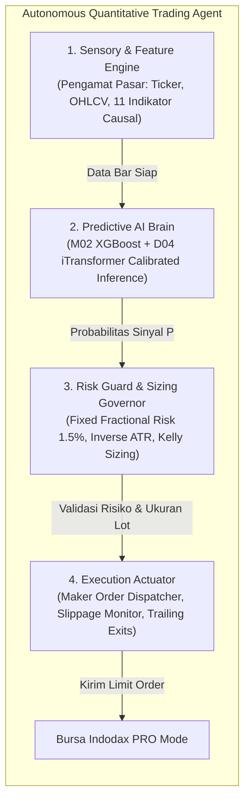

# Arsitektur Agen Kuantitatif, Pembelajaran Berkelanjutan, dan Desain Position Sizing

**Dokumen Rujukan Desain Produksi & Roadmap Masa Depan**  
**Klasifikasi**: Konsep Sistem Produksi, Manajemen Risiko Kuantitatif, & Klarifikasi Taksonomi AI  
**Status**: ACTIVE REFERENCE (Sebagai panduan arsitektur transisi riset ke produksi)

---

## 1. Definisi Sistem: Mengapa Bot Ini Disebut "Autonomous Trading Agent"?

Sistem kuantitatif yang kita kembangkan bukan sekadar script trading sederhana, melainkan sebuah **Autonomous Trading Agent** (atau *Quantitative Strategy Worker*) yang beroperasi 24/7 di bursa Indodax melalui 4 subsistem otonom yang terisolasi:

1. **Sensory Engine (Indera)**: Menangkap pergerakan harga tanpa kebocoran data (*point-in-time*), menghitung indikator teknikal (EMA, ATR, ADX, RSI, Bollinger Bands, Volume Z-Score) secara deterministik pada penutupan setiap bar 1 jam.
2. **Predictive AI Brain (Otak)**: Model AI terkalibrasi yang menghitung estimasi probabilitas objektif $P(\text{Harga Naik} > \text{Fee Bursa})$.
3. **Risk Guard & Governor (Regulator Risiko)**: Memastikan batas eksposur portofolio tidak dilanggar, alokasi kas Rupiah tersedia, dan menghitung ukuran lot yang aman.
4. **Execution Actuator (Tangan Eksekutor)**: Mengirimkan pesanan pasif (*Maker limit order*), memantau status pemenuhan (*fills*), dan mengelola *trailing stop* serta *time-decay exit*.

---

## 2. Bagaimana Membuat Agent "Makin Pintar" di Masa Depan (Tanpa Overfitting)

Di dunia finansial institusional, model dilarang belajar secara langsung setiap detik di live market karena rentan mengalami *catastrophic forgetting* (menghafal kepanikan pasar sesaat). Mekanisme yang terbukti untuk meningkatkan kecerdasan Agent secara berkala adalah **3 Siklus Terstruktur**:

### A. Post-Trade Attribution (Buku Hitam Kesalahan)
Setiap transaksi yang selesai dicatat ke dalam audit log detail:
* Fitur pasar saat entri, probabilitas model AI saat masuk ($P$), dan alasan keluar (TP, Trailing SL, atau Time-decay).
* Transaksi yang merugi (*False Positives*) dikelompokkan sebagai **Hard Negative Examples** untuk menjadi bahan pembelajaran khusus pada sesi pelatihan ulang berikutnya.

### B. Walk-Forward Rolling Retraining (Refresh Berkala Bulanan/Kuartalan)
Secara terjadwal (misal akhir bulan):
1. Menambahkan data 1 bulan terbaru yang sudah terverifikasi ke dalam dataset latih.
2. Membuang data terlama (atau menerapkan *exponential decay weight*) agar model berfokus pada rezim pasar terkini.
3. Melakukan *fine-tuning* terarah (5–10 epoch pada GPU lokal) untuk memperbarui bobot model.
4. **Safety Gate**: Model baru wajib lulus uji *Shadow Validation* (tidak boleh menurunkan AUC OOS dan metrik net PnL) sebelum diizinkan menggantikan model lama.

### C. Dynamic Ensemble Weighting (Multi-Armed Bandit)
Pada sistem *Ensemble* (XGBoost + iTransformer):
* Bobot voting ($w_1, w_2$) dapat disesuaikan secara adaptif. Jika pada kuartal ini iTransformer menunjukkan akurasi lebih tinggi dalam membaca tren pasar, sistem secara otomatis menaikkan bobot suaranya.

---

## 3. Desain Position Sizing Matematis (Formula Emas Manajemen Kas)

Menentukan ukuran transaksi **TIDAK BISA** dipukul rata (misalnya flat 20% modal), karena volatilitas koin berbeda drastis (**SOL bergerak 6%–8%/hari**, sedangkan **BTC hanya 1.5%–2%/hari**). Jika modal dibagi rata, risiko kerugian di SOL menjadi 4x lipat lebih besar dibanding BTC.

Berikut formula sizing profesional yang kita integrasikan:

### A. Fixed Fractional Risk (Aturan Risiko Maksimal 1.5%)
> **Prinsip Utama**: *"Bukan modal kas yang dibagi rata, tetapi RISIKO RUPIAH-nya yang disamakan secara konstan."*

$$\text{Nominal Risiko Maksimal (Rp)} = \text{Total Portofolio} \times 1.5\%$$

$$\text{Ukuran Posisi (Rp)} = \frac{\text{Nominal Risiko Maksimal (Rp)}}{\text{Jarak Stop Loss (\%)}} = \frac{\text{Nominal Risiko}}{1.75 \times \text{ATR}}$$

* **Contoh Nyata (Modal Rp 1.000.000, Risiko Maksimal = Rp 15.000)**:
  - **BTC (Volatilitas Tenang, SL 2%)**: Ukuran Posisi = $\frac{\text{Rp 15.000}}{0.02} = \text{Rp 750.000}$. Jika kena SL, kerugian persis **Rp 15.000**.
  - **SOL (Volatilitas Liar, SL 8%)**: Ukuran Posisi = $\frac{\text{Rp 15.000}}{0.08} = \text{Rp 187.500}$. Jika kena SL, kerugian tetap persis **Rp 15.000**.
* **Hasil**: Akun kebal terhadap kebangkrutan (*anti-fragile*) karena risiko Rupiah selalu terkunci identik per transaksi.

### B. Confidence-Weighted Sizing (Half-Kelly Criterion)
Ukuran posisi disesuaikan secara proporsional dengan keyakinan model AI:
* Probabilitas Marjinal ($P \in [0.38, 0.42)$) $\to$ **0.5x ukuran normal**.
* Probabilitas Standar ($P \in [0.43, 0.48)$) $\to$ **1.0x ukuran normal**.
* Probabilitas Tinggi ($P \ge 0.49$) $\to$ **1.5x ukuran normal**.

### C. Batasan Pengaman Keras (*Hard Constraints*)
1. **Max Position Cap**: Maksimal 25% – 30% dari total kas untuk satu koin tunggal.
2. **Max Open Positions**: Maksimal 3 posisi terbuka secara simultan (1 BTC, 1 ETH, 1 SOL).
3. **Cash Buffer**: Selalu menyisakan minimal 10% kas IDR menganggur untuk menyerap fee bursa dan slippage tanpa menimbulkan *insufficient funds*.

---

## 4. Klarifikasi Mutlak Mengenai Reinforcement Learning (RL)

### Pertanyaan: Apakah Ada Aspek RL di Dalam Bot Ini?
**JAWABAN TEGAS: TIDAK ADA SAMA SEKALI.**

Di dalam seluruh alur strategi aktif kita saat ini (C01, C02, C07, M01–M04, D01–D04, Ensemble), **0% menggunakan Reinforcement Learning**.

Sistem kita 100% menggunakan:
1. **Supervised Learning (Klasifikasi Probabilistik Terarah)**: Model memetakan fitur indikator historis ke probabilitas empiris $P(\text{Harga Naik} > \text{Fee})$, dikalibrasi dengan **Platt Sigmoid**.
2. **Quantitative Rule-Based Framework**: Aturan teknikal (EMA, Donchian, Bollinger Bands, RSI, ADX).
3. **Deterministic Mathematical Risk**: Stop loss asimetris berbasis ATR dan formula Half-Kelly.

### Mengapa RL Tidak Digunakan? (Catatan Riset R01-01 di Repositori):
Di repositori ini terdapat modul eksperimental [docs/research/rl-feasibility.md](file:///D:/bot-trading/docs/research/rl-feasibility.md) dan [src/indodax_lab/models/r01_rl_allocator.py](file:///D:/bot-trading/src/indodax_lab/models/r01_rl_allocator.py) yang secara eksplisit menguji kelayakan RL di Indodax. Hasil riset tersebut menyimpulkan:
1. **Tergilas Fee Bursa**: Agen RL dinamis menghasilkan *turnover* posisi yang terlalu sering. Di Indodax (fee 0.43%), keuntungan kotor langsung musnah dan menghasilkan Sharpe negatif (-0.45).
2. **Reward Hacking**: Jika agen RL diberi penalti fee, agen tersebut langsung mengalami kelumpuhan (*reward hacking*) dan memilih **100% memegang kas Rupiah selamanya**.
3. **Status Keamanan**: Modul RL dipasangi error pengunci `LiveExecutionForbiddenError` dan statusnya dikunci sebagai `EXPERIMENTAL` (dilarang masuk ke jadwal eksekusi live).
