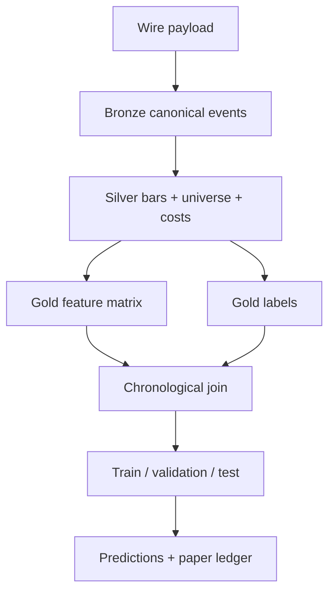

# Dataset, Feature, and Label Contracts

**Versi kontrak:** 1.0.0
**Tanggal:** 2026-08-06
**Baseline repository:** `main@70a9fd611a2db36d5e0b8917498ee47a30d15c47`
**Scope:** offline research, deterministic backtest, ML/DL training, dan forward paper/shadow
**Design induk:** [`Indodax Strategy Research Lab`](../superpowers/specs/2026-08-06-strategy-research-lab-design.md)

## 1. Jawaban singkat: apakah dataset memakai indikator?

**Ya.** Dataset model akan memuat indikator teknikal, termasuk indikator yang sudah digunakan bot saat ini: EMA 20/50, Stochastic RSI, MACD, Bollinger Bands, ATR, ADX/+DI/-DI, dan volume MA. Namun indikator disimpan sebagai **feature yang versioned**, bukan dianggap sebagai kebenaran atau trigger universal.

Tiga lapisan input dipisahkan:

1. **Market primitives:** OHLCV, trade, spread, depth, dan timestamp.
2. **Derived features:** return, volatility, liquidity, indikator teknikal, regime, dan cross-asset ranks.
3. **Labels:** hasil masa depan setelah biaya, Triple Barrier, rank return, volatility, atau meta-label.

Feature dan label tidak boleh berada dalam file/table yang sama sebelum proses training join dilakukan. Pemisahan ini mengurangi risiko label bocor ke inference pipeline.

## 2. Keputusan kontrak yang mengikat

| Area | Keputusan |
|---|---|
| Internal pair ID | Gunakan format kompatibel bot lama, mis. `btc_idr`; simpan `venue_symbol=btcidr` terpisah. |
| Waktu | UTC canonical menggunakan Arrow `timestamp[us, tz=UTC]`; epoch asli disimpan bersama unit-nya bila perlu audit. |
| Availability | Feature hanya boleh dipakai bila `feature_ready_at <= decision_ts`. |
| Execution | Sinyal pada closed bar dieksekusi paling cepat pada next-bar open atau event berikutnya sesuai policy. |
| Raw data | Append-only dan immutable; koreksi menghasilkan partition/schema version baru. |
| Storage | Parquet + Zstandard untuk tabel analitik, DuckDB untuk catalog/query, compressed JSONL untuk raw wire payload. |
| Ledger | Decimal/integer units; tidak memakai binary float sebagai sumber kebenaran cash/quantity/fee. |
| Feature values | `float64` diperbolehkan untuk transformasi analitik; nilai price/quantity asal tetap tersedia dalam Decimal. |
| Missing data | Tidak ada backward fill. Forward fill hanya untuk metadata yang eksplisit, memiliki TTL, dan sudah tersedia saat itu. |
| Split | Kronologis global; scaler/imputer/selector di-fit pada train fold saja. |
| Versioning | Perubahan formula, source, lookback, lag, cost, atau label menaikkan version/hash. |
| LOB | Candle tidak boleh digunakan sebagai pengganti order book. LOB features hanya dari sequence window berstatus PASS. |

## 3. Aliran data



Tidak ada worker hilir yang menulis ulang layer di atasnya. Sebuah snapshot menunjuk partition immutable melalui checksum; eksperimen menunjuk snapshot, bukan path “latest” yang dapat berubah.

## 4. Zona penyimpanan

| Zona | Contoh dataset | Mutability | Consumer |
|---|---|---|---|
| `wire` | HTTP/WebSocket payload persis seperti diterima | Append-only | Parser audit/replay |
| `bronze` | Candle, public trade, book event yang sudah canonical | Append-only per schema version | Sentry, bar builder |
| `silver` | Time/event bars, universe, cost schedule, data quality | Immutable snapshot | Strategy, feature, label builder |
| `gold` | Feature matrix, labels, splits, predictions | Immutable per version | ML/DL/backtest/evaluator |
| `ops` | Run registry, queue, paper events, ledger postings | Transactional | Orchestrator, reports |

Layout runtime default, di luar Git:

```text
lab-data/
  wire/source=indodax/dataset=public_trades/event_date=YYYY-MM-DD/
  bronze/dataset=candles/schema=v1/interval=1m/pair=btc_idr/year=YYYY/month=MM/
  bronze/dataset=trades/schema=v1/pair=btc_idr/event_date=YYYY-MM-DD/
  bronze/dataset=book_events/schema=v1/pair=btc_idr/event_date=YYYY-MM-DD/
  silver/dataset=bars/schema=v1/bar_type=time/interval=1h/pair=btc_idr/year=YYYY/
  silver/dataset=bars/schema=v1/bar_type=cusum/pair=btc_idr/year=YYYY/
  silver/dataset=universe/schema=v1/as_of_date=YYYY-MM-DD/
  gold/dataset=features/feature_set=tabular_bar_v1/pair=btc_idr/year=YYYY/
  gold/dataset=labels/label_set=net_return_v1/pair=btc_idr/year=YYYY/
  snapshots/<dataset_snapshot_id>/manifest.json
lab-artifacts/
  runs/<run_id>/
  models/<model_id>/<model_version>/
  reports/<report_id>/
```

Writer membuat file `.partial`, menutup file, menghitung checksum, lalu melakukan atomic rename. Partition kecil dikompaksi agar tidak menghasilkan ribuan file mungil. DuckDB adalah catalog/query layer; Parquet + manifest tetap menjadi snapshot source of truth.

## 5. Identity, waktu, dan lineage

Semua tabel analitik wajib membawa kolom lineage yang relevan:

| Field | Type | Makna |
|---|---|---|
| `schema_version` | `string` | Semantic schema version, mis. `1.0.0`. |
| `source` | `string` | Adapter/endpoint/provider. |
| `source_event_id` | `string?` | ID atau deterministic hash event dari source. |
| `event_ts` | UTC timestamp | Waktu kejadian market. |
| `ingested_at` | UTC timestamp | Waktu data diterima collector. |
| `available_at` | UTC timestamp | Waktu paling awal informasi boleh digunakan. |
| `dataset_snapshot_id` | `string` | Content-addressed manifest ID. |
| `quality_status` | enum | `PASS`, `WARN`, `FAIL`, `QUARANTINED`. |
| `quality_flags` | `list<string>` | Reason codes yang tidak ambigu. |

Aturan timestamp:

- `event_ts` dan `ingested_at` tidak boleh dipertukarkan.
- Raw API v2 `time` disimpan sebagai millisecond timestamp dan dinormalisasi ke UTC; unit tidak ditebak dari magnitude tanpa schema/parser test.
- Untuk time bar, `close_time` bersifat end-exclusive: bar `[10:00, 11:00)` ditutup pada `11:00`.
- `feature_ready_at = close_time + configured_availability_lag` untuk closed-bar feature.
- `decision_ts` harus lebih besar atau sama dengan setiap `feature_ready_at` yang di-join.
- Report lokal boleh menampilkan WITA/WIB, tetapi timezone itu tidak masuk primary key.

## 6. Kontrak tabel sumber dan curated

### 6.1 `bronze_candles_v1`

**Grain:** satu pair × interval × open time.
**Primary key:** (`pair`, `interval`, `open_time`, `source`).

| Field | Arrow type | Rule |
|---|---|---|
| `pair` | `string` | `btc_idr`, lowercase underscore. |
| `venue_symbol` | `string` | `btcidr`/format resmi endpoint. |
| `interval` | `string` | `1m`, `5m`, `15m`, `1h`, `4h`, `1d`. |
| `open_time`, `close_time` | UTC timestamp | Monotonic per pair/interval. |
| `open`, `high`, `low`, `close` | `decimal128(38,12)` | Positive; memenuhi OHLC invariant. |
| `base_volume` | `decimal128(38,18)` | `>= 0`. |
| `quote_volume` | `decimal128(38,12)?` | Null bila tidak tersedia; estimasi diberi flag. |
| `trade_count` | `int64?` | Null bukan nol bila source tidak memberi. |
| `is_closed` | `bool` | Training hanya memakai `true`. |
| `available_at` | UTC timestamp | Tidak lebih awal dari `close_time`. |
| `source`, `ingested_at` | string, UTC timestamp | Wajib. |
| `quality_status`, `quality_flags` | string, list | Wajib. |

OHLC invariants:

```text
high >= max(open, close)
low  <= min(open, close)
high >= low
open, high, low, close > 0
base_volume >= 0
```

### 6.2 `bronze_public_trades_v1`

**Grain:** satu executed public trade.
**Primary key:** (`pair`, `source_event_id`) atau deterministic event hash bila source tidak memberi ID.

| Field | Type | Rule |
|---|---|---|
| `event_ts`, `ingested_at`, `available_at` | UTC timestamp | `available_at >= ingested_at >= event_ts` normal case; clock anomalies diberi flag. |
| `pair`, `venue_symbol` | string | Canonical + source identity. |
| `sequence` | int64? | Null bila stream tidak menyediakan. |
| `aggressor_side` | enum? | `BUY`, `SELL`, `UNKNOWN`; tidak ditebak tanpa contract. |
| `price` | decimal | Positive. |
| `base_qty`, `quote_qty` | decimal | Positive; quote dapat dihitung dengan flag. |
| `source_event_id` | string | Stable ID/hash untuk dedup. |
| `quality_status`, `quality_flags` | string, list | Sequence gap menyebabkan FAIL pada affected window. |

Account `myTrades` disimpan terpisah dari public research events. Kontrak resmi API v2 menggunakan `isBuyer`, `isMaker`, `qty`, `quoteQty`, `commission`, `commissionAsset`, dan `time` dalam milidetik. Dataset account tidak boleh masuk model karena dapat mengandung selection behavior pengguna.

### 6.3 `bronze_book_events_v1`

**Grain:** satu perubahan level atau satu snapshot level.
**Key:** (`pair`, `book_session_id`, `sequence`, `side`, `price`).

Kolom minimum: `event_ts`, `available_at`, `pair`, `book_session_id`, `sequence`, `event_type`, `side`, `level`, `price`, `base_qty`, `source`, `quality_status`.

Satu `book_session_id` dimulai setelah snapshot/recovery yang valid. Sequence gap menutup session yang reliable. Feature LOB tidak boleh melewati batas session atau window berstatus FAIL.

### 6.4 `silver_bars_v1`

**Grain:** satu bar yang final.
**Key:** (`bar_id`). `bar_id` adalah hash deterministik dari pair, bar type, boundaries, threshold config, dan source snapshot.

Selain OHLCV, tabel menyimpan:

- `bar_type`: `TIME`, `CUSUM`, `RANGE`, `VOLUME`, `DOLLAR`;
- `interval` untuk time bars atau `threshold_config_id` untuk event bars;
- `first_event_ts`, `last_event_ts`, `open_time`, `close_time`, `available_at`;
- `buy_base_volume`, `sell_base_volume`, `trade_count` bila side tersedia;
- `source_snapshot_id`, `quality_status`, `quality_flags`.

Wave 1 menggunakan time bars. CUSUM/range/volume/dollar bars baru diaktifkan setelah trade-event coverage lulus sentry dan selalu dibandingkan terhadap time-bar baseline.

### 6.5 `silver_universe_v1`

**Grain:** satu pair × `as_of_date`.
**Key:** (`as_of_date`, `pair`, `universe_policy_version`).

Kolom wajib:

```text
as_of_date, pair, asset, quote_asset, listed_at, listing_age_days,
market_cap_usd, market_cap_rank, cap_source_ts,
median_quote_volume_30d, median_spread_bps_7d,
depth_10bps, depth_50bps, zero_volume_ratio_30d,
tier, eligible, reason_codes, available_at, source
```

`tier` adalah `BIG_CAP`, `SMALL_CAP`, atau `LIQUIDITY_ONLY`. Bila market-cap historis tidak tersedia, nilai tidak diisi dari keadaan hari ini; pair turun menjadi `LIQUIDITY_ONLY`.

### 6.6 `silver_cost_schedule_v1`

**Grain:** satu market × side × role × validity range.

```text
cost_schedule_id, venue, quote_asset, side, liquidity_role,
service_fee_rate, tax_rate, exchange_component_rate,
fixed_fee_quote, min_order_quote, valid_from, valid_to,
source_url, retrieved_at, schema_version
```

`valid_to` boleh null untuk schedule aktif. Schedule overlap pada key yang sama adalah hard error. Label/backtest menyimpan `cost_schedule_id`; mengubah biaya berarti membuat label/backtest version baru.

## 7. Kontrak feature matrix

### 7.1 Key dan metadata row

**Grain default Wave 1:** satu eligible pair × closed 1h decision bar × target horizon.

| Field | Type | Rule |
|---|---|---|
| `sample_id` | string | Hash deterministic dari key dan versions. |
| `decision_ts` | UTC timestamp | Waktu keputusan; tidak sama dengan label end. |
| `pair` | string | Internal canonical pair. |
| `decision_interval` | string | Default `1h`. |
| `bar_id` | string | Source decision bar. |
| `horizon_id` | string | Mis. `4h`, `12h`, `24h`, atau Triple Barrier config. |
| `feature_set_id`, `feature_set_version` | string | Mis. `tabular_bar`, `1.0.0`. |
| `dataset_snapshot_id` | string | Immutable source snapshot. |
| `universe_snapshot_id` | string | Point-in-time universe. |
| `row_ready_at` | UTC timestamp | Max availability semua feature row. |
| `eligible` | bool | Hasil universe/data gate saat itu. |
| `missing_feature_count` | int32 | Audit, tidak digunakan sebagai label. |
| `quality_flags` | list<string> | Input quality provenance. |

Feature name selalu memakai timeframe suffix (`_15m`, `_1h`, `_4h`, `_1d`) kecuali feature cross-sectional/event yang intervalnya eksplisit di registry.

### 7.2 Feature registry

Setiap feature terdaftar di `configs/features/<feature_set>.yaml`. Contract minimum:

```yaml
feature_set_id: tabular_bar
version: 1.0.0
decision_interval: 1h
features:
  - name: ema_ratio_20_50_1h
    family: trend
    source_columns: [close]
    formula: ema(close,20)/ema(close,50)-1
    implementation: indodax_lab.features.technical:ema_ratio
    params: {fast: 20, slow: 50}
    lookback_bars: 200
    availability: closed_bar
    lag_bars: 0
    dtype: float64
    missing_policy: drop_sample_until_warm
    normalization: train_robust_scale
    monotonicity: none
```

Registry loader menolak:

- nama duplikat;
- formula/implementation kosong;
- lookback lebih kecil dari kebutuhan indikator;
- timeframe join tanpa availability policy;
- `bfill` sebagai missing policy;
- perubahan isi tanpa kenaikan version.

### 7.3 Wave 1 `tabular_bar_v1`

Feature set awal sengaja kompak. Ini cukup untuk logistic/elastic-net, XGBoost, serta strategi/risk diagnostics tanpa “indicator zoo”.

| Family | Feature | Formula ringkas |
|---|---|---|
| Return | `log_ret_{1,3,6,12,24,72}_1h` | `log(close_t / close_t-k)` |
| Range | `dist_high_20_1h`, `dist_low_20_1h` | Jarak close terhadap rolling high/low, dinormalisasi close |
| Trend | `ema_ratio_20_50_1h` | `EMA20/EMA50 - 1` |
| Trend | `ema20_slope_5_1h` | Perubahan EMA20 5 bar / ATR |
| Trend | `donchian_pos_20_1h` | Posisi close dalam high-low 20 bar |
| Momentum | `rsi_centered_14_1h` | `(RSI14 - 50) / 50` |
| Momentum | `stochrsi_k_14_1h`, `stochrsi_d_14_1h` | Nilai K/D dibagi 100 |
| Momentum | `macd_hist_atr_1h` | MACD histogram / ATR14 |
| Trend strength | `adx_14_1h`, `di_spread_14_1h` | ADX/100, `(+DI - -DI)/100` |
| Volatility | `atr_pct_14_1h` | ATR14 / close |
| Volatility | `rv_24_1h`, `rv_168_1h` | Std log return pada 24/168 bar |
| Volatility | `downside_vol_24_1h` | RMS return negatif |
| Volatility | `parkinson_vol_24_1h` | Range-based estimator dari high/low |
| Bands | `bb_z_20_1h`, `bb_width_20_1h` | Posisi terhadap BB mid/std dan normalized width |
| Volume | `volume_z_20_1h` | Z-score `log1p(base_volume)` |
| Volume | `quote_turnover_24_1h` | Rolling quote volume, log-scaled/ranked |
| Volume | `zero_volume_ratio_24_1h` | Proporsi bar volume nol |
| Liquidity | `amihud_24_1h` | Mean `abs(return)/quote_volume` dengan safe mask |
| VWAP | `vwap_dev_24_1h` | `close / rolling_vwap - 1` |
| Context | `btc_log_ret_{1,24}_1h` | BTC return yang tersedia saat decision |
| Context | `beta_btc_168_1h` | Rolling covariance/beta, minimum observations wajib |
| Cross-section | `tier_momentum_rank_24_1h` | Percentile rank dalam eligible tier saat itu |
| Cross-section | `market_breadth_pos_24_1h` | Fraksi eligible pair dengan return 24h positif |
| Regime | `market_rv_median_24_1h` | Median volatility eligible universe |
| Calendar | `hour_sin_utc`, `hour_cos_utc` | Cyclical known-at-time encoding |
| Calendar | `dow_sin_utc`, `dow_cos_utc` | Cyclical day-of-week encoding |
| Listing | `log_listing_age_days` | `log1p(age)` dari point-in-time metadata |
| Quality | `bar_completeness_24_1h` | Proporsi expected closed bars valid |

Untuk multi-timeframe model, subset trend/volatility yang sama dibuat dengan suffix `_4h` dan `_1d`, lalu di-join dengan as-of availability. Daily bar yang masih berjalan tidak boleh digunakan. Feature 15m digunakan terutama untuk entry/meta-label, bukan otomatis digabung ke semua model.

### 7.4 Indikator bot lama ke feature lab

| Bot saat ini | Feature lab | Perubahan penting |
|---|---|---|
| EMA20/EMA50 | `ema_ratio_20_50_*`, `ema20_slope_5_*` | Gunakan rasio/slope agar comparable lintas harga aset. |
| StochRSI K/D | `stochrsi_k_14_*`, `stochrsi_d_14_*` | Simpan continuous value; crossover rule boleh menjadi feature terpisah untuk ablation. |
| MACD histogram | `macd_hist_atr_*` | Dinormalisasi ATR, bukan raw IDR. |
| Bollinger Bands | `bb_z_20_*`, `bb_width_20_*` | Posisi dan bandwidth lebih portable daripada raw band price. |
| ATR14 | `atr_pct_14_*` | Dinormalisasi close; raw ATR tetap tersedia untuk execution/risk. |
| ADX/+DI/-DI | `adx_14_*`, `di_spread_14_*` | Continuous, bukan hanya boolean threshold 25. |
| Volume MA20 | `volume_z_20_*`, `quote_turnover_24_*` | Bedakan base volume, quote turnover, dan missingness. |

Implementasi awal boleh memakai `pandas-ta`, tetapi output diberi nama internal yang stabil. Golden fixture membandingkan nilai pada data kecil; upgrade library tidak boleh mengubah feature diam-diam.

### 7.5 LOB/microstructure feature set terpisah

`lob_v1` tidak masuk Wave 1. Bila data PASS tersedia, candidate features:

```text
spread_bps, mid_price, microprice_delta_bps,
book_imbalance_l1, book_imbalance_l5, book_imbalance_l10,
depth_bid_10bps, depth_ask_10bps, depth_ratio_10bps,
order_flow_imbalance_1s, order_flow_imbalance_10s,
trade_imbalance_10s, trade_imbalance_60s,
cancel_insert_ratio_10s, book_slope_bid, book_slope_ask,
realized_spread_bps, sequence_gap_flag
```

Snapshot frequency, depth levels, aggregation window, and latency are part of feature version. `sequence_gap_flag=true` makes the row ineligible rather than becoming a predictive input.

## 8. Availability dan anti-leakage

### 8.1 Closed-bar rule

Untuk keputusan pada close 1h:

```text
feature window: seluruh data dengan available_at <= decision_ts
signal time:    decision_ts
earliest fill:  next 1h open atau next market event sesuai execution policy
label window:   dimulai dari simulated fill, bukan dari close pembentuk feature
```

Jika production latency 5 detik digunakan, backtest juga memakai `availability_lag=5s`. Menggunakan close/high/low bar yang belum final adalah leakage.

### 8.2 As-of join

Join antar timeframe/provider menggunakan:

```sql
source.available_at <= sample.decision_ts
ORDER BY source.available_at DESC
LIMIT 1
```

Join pada calendar date saja dilarang untuk feature intraday. `source_ts` dan `available_at` provider eksternal harus disimpan; timestamp revisi data tidak boleh disamakan dengan waktu kejadian.

### 8.3 Preprocessing fit scope

Berikut di-fit pada train fold dan diserialisasi bersama model:

- median/imputer value;
- mean/std atau robust scaler;
- winsorization/clip thresholds;
- correlation pruning/feature selector;
- categorical encoder;
- calibration model;
- execution/no-trade threshold.

Validation/test tidak boleh memengaruhi nilai tersebut. Sequence padding memakai mask; nol padding tidak boleh terlihat seperti genuine zero return/volume.

### 8.4 Missing policy

| Kondisi | Policy |
|---|---|
| Indicator warmup | Null lalu sample di-drop dengan reason `INSUFFICIENT_LOOKBACK`. |
| Candle gap | Jangan isi OHLC; tandai gap dan rebuild dari trades hanya bila prosedur resmi/versioned tersedia. |
| Quote volume tidak tersedia | Null atau estimasi `typical_price × base_volume` dengan `QUOTE_VOLUME_ESTIMATED`. |
| Static metadata belum berubah | Forward fill dengan TTL dan `available_at`; tidak pernah backward fill. |
| Market cap historis tidak ada | Tier `LIQUIDITY_ONLY`; jangan memakai cap hari ini. |
| Small-cap zero volume | Nilai nol asli tetap nol; missing bar tetap null/gap. |
| Feature optional tidak tersedia | Gunakan mask/eligible policy yang terdaftar; jangan silent zero. |

## 9. Kontrak label

### 9.1 `net_return_v1`

**Tujuan:** regression atau binary classification setelah biaya.

```text
entry_ts        = first eligible execution event after decision_ts
entry_price     = execution_model.buy_price(...)
exit_ts         = configured horizon after entry_ts
exit_price      = execution_model.sell_price(...)
net_return      = (net_sell_proceeds / total_buy_cash_debit) - 1
binary_label    = 1 if net_return > edge_margin else 0
```

Kolom minimum:

```text
sample_id, label_set_id, label_version, entry_ts, exit_ts,
entry_price, exit_price, gross_return, buy_cost, sell_cost,
slippage_cost, net_return, binary_label, cost_schedule_id,
execution_model_version, label_available_at
```

`label_available_at=exit_ts` (atau waktu fill final), sehingga label tidak dapat muncul pada dataset inference.

### 9.2 `triple_barrier_v1`

Barrier dihitung dari volatility estimate yang tersedia pada `decision_ts`, lalu diterapkan setelah simulated entry:

```text
upper = entry_price * (1 + pt_multiplier * target_vol)
lower = entry_price * (1 - sl_multiplier * target_vol)
vertical = entry_ts + horizon
label = +1 bila upper dulu, -1 bila lower dulu, 0 bila vertical dulu
```

Tabel juga menyimpan `first_touch_ts`, `label_end_ts`, `mfe`, `mae`, gross/net return, dan barrier config ID. Jika upper dan lower tersentuh dalam candle sama tanpa data lebih rinci, default konservatif adalah lower/SL first. Event yang overlap membawa `concurrency_count` dan `sample_weight`.

### 9.3 `cross_section_rank_v1`

Pada setiap decision timestamp, hitung forward net return hanya pada pair yang `eligible=true` dalam universe snapshot saat itu. Simpan percentile/ordinal rank serta universe count. Aset delisted tidak boleh dihapus dari sampel historis.

### 9.4 `meta_label_v1`

Base strategy menghasilkan side long dan planned horizon/stop. Model hanya memutuskan `TAKE` atau `SKIP` serta optional size band. Feature base signal (score, distance to stop, regime) boleh digunakan bila available, tetapi outcome manual callback pengguna tidak boleh dijadikan ground truth.

### 9.5 Label volatility/risk

Model risk boleh memprediksi realized volatility/quantile, max adverse excursion, atau anomaly probability. Model tersebut berfungsi sebagai sizing/abstain gate; bukan perintah buy langsung.

## 10. Dataset split dan model evaluation

### 10.1 Historical gate `annual_v1`

| Periode | Peran |
|---|---|
| Earliest reliable–2022-12-31 | Discovery/train dengan anchored inner folds |
| 2023 | Outer validation dan family/parameter-range choice |
| 2024 | Sealed test versi yang sudah dibekukan |
| 2025 | Final historical confirmation |
| 2026+ | Forward paper/shadow |

Tanggal tersebut adalah role split, bukan pernyataan bahwa data dimulai/berakhir pada 2023. Pair hanya masuk setelah `first_reliable_at` dan minimum lookback terpenuhi.

### 10.2 Inner walk-forward

Default untuk tuning:

- expanding train;
- validation window 3 bulan;
- step 1 bulan;
- minimal train 12 bulan bila history memungkinkan;
- purge seluruh sample yang `label_end_ts` melewati boundary;
- embargo minimal sebesar maksimum horizon/overlap yang dikonfigurasi.

Fold definition disimpan sebagai table/manifest, bukan dibentuk ulang secara implisit oleh notebook.

### 10.3 Foundation model cutoff

Evaluation F01 menyimpan model release date, declared pretraining cutoff, known corpus, dan `contamination_risk`. Data yang berpotensi berada dalam pretraining corpus tidak dapat menjadi satu-satunya bukti. Test paling kuat adalah forward data setelah cutoff/release yang belum mungkin dilihat model.

## 11. Training dataset materialization

Builder menerima empat ID eksplisit:

```text
dataset_snapshot_id
feature_set_id@version
label_set_id@version
split_id@version
```

Output manifest minimum:

```json
{
  "training_dataset_id": "sha256:...",
  "feature_set": "tabular_bar@1.0.0",
  "label_set": "net_return@1.0.0",
  "split": "annual@1.0.0",
  "row_count": 0,
  "pair_count": 0,
  "min_decision_ts": "...",
  "max_decision_ts": "...",
  "feature_columns": [],
  "source_checksums": {},
  "quality_report_id": "...",
  "created_at": "..."
}
```

Materialization gagal bila:

- ada duplicate `sample_id`;
- `row_ready_at > decision_ts`;
- label masuk feature columns;
- split chronology overlap tanpa purge/embargo;
- universe snapshot tidak ditemukan;
- cost schedule untuk label tidak ditemukan;
- source partition checksum berubah.

## 12. Contoh row

Feature row (nilai ilustratif, bukan rekomendasi trading):

```json
{
  "sample_id": "sha256:7f...",
  "decision_ts": "2026-07-14T11:00:00Z",
  "pair": "btc_idr",
  "decision_interval": "1h",
  "horizon_id": "12h",
  "feature_set_id": "tabular_bar",
  "feature_set_version": "1.0.0",
  "dataset_snapshot_id": "sha256:ab...",
  "universe_snapshot_id": "sha256:cd...",
  "row_ready_at": "2026-07-14T11:00:05Z",
  "eligible": true,
  "ema_ratio_20_50_1h": 0.0124,
  "rsi_centered_14_1h": 0.18,
  "macd_hist_atr_1h": 0.07,
  "atr_pct_14_1h": 0.021,
  "volume_z_20_1h": 1.36,
  "tier_momentum_rank_24_1h": 0.82,
  "missing_feature_count": 0,
  "quality_flags": []
}
```

Label row terpisah:

```json
{
  "sample_id": "sha256:7f...",
  "label_set_id": "net_return",
  "label_version": "1.0.0",
  "entry_ts": "2026-07-14T12:00:00Z",
  "exit_ts": "2026-07-15T00:00:00Z",
  "gross_return": 0.0091,
  "net_return": 0.0018,
  "binary_label": 1,
  "cost_schedule_id": "indodax_idr_taker_2025_08_v1",
  "execution_model_version": "next_open_spread_v1",
  "label_available_at": "2026-07-15T00:00:00Z"
}
```

## 13. Dataset/model artifact boundary

Model artifact tidak hanya berisi weights. Bundle minimum:

```text
model.bin / model.pt
model_manifest.json
feature_order.json
preprocessor.bin
calibrator.bin (jika ada)
execution_threshold.json
training_metrics.json
environment.lock
```

Manifest menyimpan training dataset ID, Git SHA, seed, model class, hyperparameters, epoch/best checkpoint, input dtypes, expected feature order, and hashes. Inference fail closed bila feature set/version/order tidak cocok.

## 14. Quality gates dan tests

### 14.1 Hard data gates

- tidak ada duplicate primary key;
- timestamp monotonic per stream/partition;
- zero OHLC invariant violations;
- zero future/as-of join violations;
- zero label column dalam inference feature matrix;
- no unresolved book sequence gap dalam LOB-eligible window;
- source checksums cocok dengan snapshot manifest;
- timezone aware dan UTC;
- cost/universe schedule coverage tersedia untuk seluruh promoted sample.

### 14.2 Feature tests

- golden values untuk EMA, StochRSI, MACD, BB, ATR, ADX, Donchian, VWAP;
- warmup/null boundary tepat;
- current closed bar boleh digunakan, future bar tidak;
- as-of join 4h/1d tidak mengambil bar yang belum ditutup;
- feature row identik untuk input/config/version yang sama;
- feature scaling hanya memakai train statistics;
- pair rescaling test: feature normalized tidak berubah hanya karena unit harga dikalikan konstanta;
- ablation report untuk raw returns vs +technical vs +liquidity vs +context.

### 14.3 Label tests

- next-open entry alignment;
- fee buy/sell dan slippage mengurangi, bukan menaikkan, net return;
- same-bar TP+SL menghasilkan SL-first pada data yang ambigu;
- Triple Barrier `label_end_ts` benar;
- purge membuang sample overlap boundary;
- rank hanya memakai eligible universe point-in-time;
- callback manual tidak memengaruhi automated label.

### 14.4 Drift/health report

Per snapshot dan forward day, report menyimpan coverage, missingness, quantiles, outlier count, population stability index atau distribution distance, unseen category, feature saturation, prediction calibration, turnover, dan estimated-cost share. Drift memicu challenger/retrain review; drift tidak otomatis mengubah champion.

## 15. Acceptance criteria kontrak

Kontrak dianggap terimplementasi bila:

1. raw wire payload dapat direplay menjadi bronze deterministically;
2. candle/trade/book/universe/cost schema tervalidasi dan versioned;
3. snapshot manifest mendeteksi perubahan source partition;
4. `tabular_bar_v1` dapat dibangun ulang byte-equivalent atau value-equivalent sesuai deterministic policy;
5. indikator bot lama tersedia sebagai feature continuous yang normalized dan lulus golden tests;
6. feature/label join menghasilkan nol availability violation;
7. annual + inner walk-forward split menyimpan purging/embargo secara eksplisit;
8. label net return memakai cost/execution model version yang diketahui;
9. small-cap missingness, zero volume, spread, dan depth tidak disamarkan;
10. model artifact menolak inference pada feature order/version yang salah;
11. data account/manual callback terpisah dari research ground truth;
12. seluruh test dapat berjalan tanpa API secret dan tanpa network.

## 16. Hal yang belum dimasukkan ke feature set awal

- sentiment/news/LLM embeddings;
- on-chain metrics;
- social media;
- full LOB features sebelum collector memenuhi data gate;
- foundation-model embeddings sebelum provenance/cutoff audit;
- user click/callback sebagai label keberhasilan.

Feature ini boleh menjadi versi baru setelah timestamp alignment, licensing, leakage, cost, dan ablation plan disetujui. Tidak ada kolom yang ditambahkan ke production model secara ad hoc.

## 17. Referensi riset yang memengaruhi kontrak

- Cakici et al. (2024), [Machine learning and the cross-section of cryptocurrency returns](https://doi.org/10.1016/j.irfa.2024.103244): feature sederhana, momentum, volatility/liquidity, dan tradability tetap penting.
- Grądzki et al. (2025), [information-driven bars + Triple Barrier](https://doi.org/10.1186/s40854-025-00866-w): alasan event bars dan finance-aware labeling dijadikan challenger.
- Bysik & Ślepaczuk (2026), [ML Bitcoin trading under transaction costs](https://arxiv.org/abs/2606.00060): alasan cost-aware no-trade mapping menjadi bagian kontrak.
- Shi et al. (2025), [Kronos](https://arxiv.org/abs/2508.02739) dan Meyer et al. (2025), [TSFM benchmarking challenges](https://arxiv.org/abs/2510.13654): alasan foundation model dipisahkan oleh provenance/cutoff gate.
- Berti & Kasneci (2025), [TLOB](https://arxiv.org/abs/2502.15757): alasan simple LOB baseline dan spread-aware target wajib sebelum model lebih kompleks.

Semua temuan eksternal adalah hipotesis untuk diuji pada Indodax, bukan klaim profitabilitas lokal.
