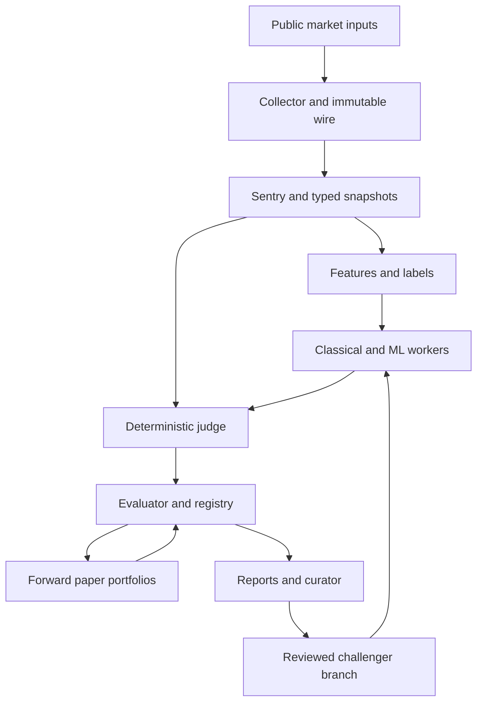

# System architecture

## Context and boundaries

The committed base has a flat Python Telegram signal bot and an adjacent lab package. Do not rewrite the bot into microservices. Isolate pure contracts, immutable datasets, execution judge and orchestration via Python modules and supervised processes. Existing CI uses Python 3.11; current installed development dependencies are not assumed reproducible until lock/profile qualification.

## Ownership and dependency direction

| Component | Reads | Writes | Forbidden dependency |
|---|---|---|---|
| Collector | Provider bytes, known durable offsets | Immutable wire/batches, gap records | Model training, strategy selection |
| Sentry | Verified bytes, explicit as_of/policy | Canonical decision artifacts | Caller-provided PASS without recomputation |
| Feature/label builder | Verified snapshot, config, cost interface | Separate feature/label/fold tables | Target access in feature construction |
| Strategy | Eligible DecisionFrame | Intent only | Cash mutation, fill determination |
| Judge | Market event, intent, schedule, risk policy | Ledger, execution/result artifacts | Network market calls during replay |
| Trainer | Assigned inner train/validation | Fitted frozen bundle | Sealed objective or mutable raw input |
| Evaluator | Results and trial history | Gate/lifecycle decisions | Running strategies or trading orders |
| Queue worker | Allowed recipe, lease, immutable inputs | Isolated outputs, heartbeat/checkpoint | Dynamic arbitrary shell from report |
| Paper | Frozen candidate and available market inputs | Forward audit, shared/independent ledgers | Exchange order credentials |

## Process and host profiles

Logical profiles: `production_main`, `collector_light`, `paper_light`, `research_cpu`, `research_gpu`. Owner-confirmed placement co-locates Production Main and Research Runtime on ASUS as separate services/authorities; Lenovo handles ML/DL training and tuning. This is target placement, not evidence services are active or capacity-qualified. Use separate environment-resolved roots, databases, credentials and resource budgets. Reserve measured ASUS headroom for Production and defer optional Research load first. Hardware constraints are admission policy inputs; unknown sensors/limits block admission. See ADR-009.

Each service authority owns its local SQLite WAL DB; even co-resident Production and Research do not share a DB. No NFS/SMB shared DB and no distributed locking invention. Lenovo-to-ASUS model delivery uses explicit import/export of immutable artifact manifests and receiving-side verification. Automated remote dispatch or Production control from Lenovo is forbidden without a separately reviewed protocol. Recovery lease needs a monotonically increasing claim generation; old workers cannot publish after a new lease is issued.

## Interfaces and identities

New interfaces are contracts, not promises files already exist. Existing public CLI names: `backfill_candles`, `validate_snapshot`, `collect_market_stream`, `build_bars`, `build_universe`. New commands are specified within owning sprint and must implement `--help`, offline fixtures and structured errors before operator use. JSON/protocol error codes must distinguish data invalidity, policy blocking, transient I/O and invalid invocation.

## Failure containment

Collector disconnection affects eligibility, not historical immutable artifacts. Corrupt artifact quarantines dependent run. Failed report transport cannot roll back trading decisions. Training crash cannot replace champion. Cache cannot override source bytes/checksum. Stop at any contract boundary mismatch and preserve evidence.

## Parallel work constraints

Feature technical and context code can be separate after registry stabilizes; central registry config needs one owner. Classical strategies can branch after common protocol, but catalog edits merge serially. Model workers may parallelize different run directories within host limits. Shared `src/main.py`, `src/telegram_bot.py`, `pyproject.toml`, SQLite migrations, manifest and CI files require ownership coordination. See execution waves; DAG eligibility alone is not permission to overlap writes.
