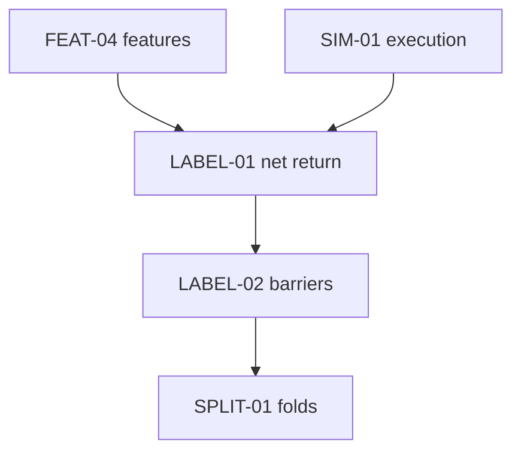
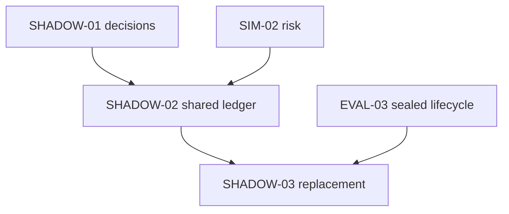

# Dependency graph
Full edge list; prerequisite → consumer. Manifest is authoritative.
| Consumer | Direct prerequisites |
|---|---|
| AGENT-01 | REPORT-01, JOB-03 |
| BAR-01 | DATA-04, DATA-05 |
| BASE-01 | None |
| BASE-02 | BASE-01 |
| BASE-03 | BASE-01 |
| BASE-04 | BASE-01 |
| BASE-05 | BASE-02, BASE-03, BASE-04 |
| BASE-06 | BASE-05 |
| D01-01 | DL-01 |
| D02-01 | D01-01, DL-02 |
| D03-01 | D02-01, LABEL-02 |
| D04-01 | D02-01 |
| DL-01 | QA-01, JOB-02 |
| DL-02 | DL-01 |
| F01-01 | DL-01 |
| F01-02 | F01-01, D01-01 |
| G01-01 | D01-01, C04-01 |
| EVAL-01 | SIM-04 |
| EVAL-02 | EVAL-01 |
| EVAL-03 | EVAL-02, SPLIT-01 |
| FEAT-01 | DATA-06 |
| FEAT-02 | FEAT-01 |
| FEAT-03 | FEAT-01 |
| FEAT-04 | FEAT-02, FEAT-03 |
| LABEL-01 | FEAT-04, SIM-01 |
| LABEL-02 | LABEL-01 |
| SPLIT-01 | LABEL-02 |
| TRAIN-01 | SPLIT-01, FEAT-04 |
| DATA-01 | BASE-01 |
| DATA-02 | DATA-01 |
| DATA-03 | DATA-02 |
| DATA-04 | DATA-03 |
| DATA-05 | DATA-02 |
| DATA-06 | BASE-06, UNIV-01, BAR-01 |
| L01-01 | LOB-01, D01-01 |
| L02-01 | L01-01 |
| LOB-01 | DATA-06, FEAT-04 |
| M01-01 | ML-03 |
| M02-01 | ML-03, M01-01 |
| M03-01 | ML-04 |
| M04-01 | ML-04 |
| M05-01 | ML-04, C01-01 |
| M06-01 | ML-04 |
| ML-01 | TRAIN-01 |
| ML-02 | ML-01, SIM-01 |
| ML-03 | ML-02, EVAL-01 |
| ML-04 | M01-01, M02-01, EVAL-03 |
| R01-01 | QA-01, SHADOW-02 |
| OPS-01 | JOB-02, SHADOW-02 |
| OPS-02 | DATA-06, JOB-01 |
| OPS-03 | OPS-02, EVAL-01 |
| JOB-01 | EVAL-01 |
| JOB-02 | JOB-01 |
| JOB-03 | JOB-02, EVAL-03, ML-04 |
| REPORT-01 | EVAL-03, SIM-04 |
| REPORT-02 | REPORT-01, SHADOW-02 |
| SHADOW-01 | EVAL-03, ML-04, DATA-05 |
| SHADOW-02 | SHADOW-01, SIM-02 |
| SHADOW-03 | SHADOW-02, EVAL-03 |
| COST-01 | DATA-01 |
| LED-01 | COST-01, BASE-04 |
| SIM-01 | COST-01, BAR-01 |
| SIM-02 | LED-01, SIM-01 |
| SIM-03 | SIM-02, DATA-06 |
| SIM-04 | SIM-03 |
| C01-01 | STRAT-01 |
| C02-01 | STRAT-01 |
| C03-01 | STRAT-01 |
| C04-01 | STRAT-01 |
| C05-01 | STRAT-01 |
| C06-01 | STRAT-01 |
| C07-01 | STRAT-01 |
| C08-01 | STRAT-01 |
| C09-01 | STRAT-01 |
| C10-01 | C01-01, C07-01 |
| C11-01 | STRAT-01 |
| C12-01 | C04-01 |
| S01-01 | STRAT-01 |
| S02-01 | STRAT-01 |
| S03-01 | STRAT-01 |
| S04-01 | STRAT-01, LOB-01 |
| S05-01 | STRAT-01 |
| S06-01 | STRAT-01 |
| S07-01 | C04-01, S01-01 |
| S08-01 | STRAT-01, LOB-01 |
| S09-01 | STRAT-01 |
| STRAT-01 | SIM-03, FEAT-04 |
| UNIV-01 | DATA-04, DATA-05 |
| QA-01 | JOB-03, SHADOW-02, C01-01, C02-01, C03-01, C04-01, C07-01, C10-01, S01-01, S02-01, ML-04 |
| QA-02 | REPORT-02, AGENT-01, OPS-02 |
| QA-03 | OPS-01, OPS-03, QA-01 |
| REL-01 | QA-02, QA-03, QA-01, REPORT-02 |
| DOC-01 | None |
| RP-01 | DOC-01, BASE-01 |
| RW0-01 | RP-01, DATA-01 |
| RW1-01 | RW0-01, DATA-06 |
| RW2-01 | RW0-01, STRAT-01 |
| RW2-02 | RW0-01, ML-04, JOB-01 |
| RW2-03 | RW2-01, RW2-02 |
| RP-02 | RW2-03, FEAT-02 |
| RP-03 | RW0-01, SIM-02 |
| PM-01 | RW0-01 |
| PM-02 | RW0-01, LED-01 |
| PM-03 | PM-01, PM-02 |
| PM-04 | PM-01, PM-02 |
| RP-04 | RP-02, RP-03, PM-02 |
| RP-05 | RP-04, PM-04 |
| RW3-01 | RW1-01, RW2-03, RP-04, EVAL-01, JOB-01 |
| RW4-01 | RW3-01, ML-04 |
| RW5-01 | RW4-01, RP-05 |
| RW5-02 | RW5-01, SHADOW-03 |
| RW6-01 | RW5-01, RP-03 |
| RW7-01 | RW1-01, RW2-03, RW4-01 |
| RW7-02 | RW7-01, RW5-02, RW6-01, RW9-01 |
| RW8-01 | RW5-02, RW6-01 |
| RW8-02 | RW8-01, RW2-03, RW3-01 |
| PM-05 | RW4-01, PM-03 |
| PM-06 | PM-05, RW5-01 |
| RW9-01 | RW4-01, RW5-02, PM-05 |
| API-00 | None |
| API-01 | API-00, PM-01, PM-02, PM-03, PM-04 |
| API-03 | API-00 |
| API-02 | API-01, API-03 |
| UI-00 | None |
| UI-01 | UI-00, API-03 |
| UI-02 | UI-01, API-02 |

## Selected critical boundaries

Nodes: 126. Edges: 226. Cycles must equal 0; enforced by validator.
