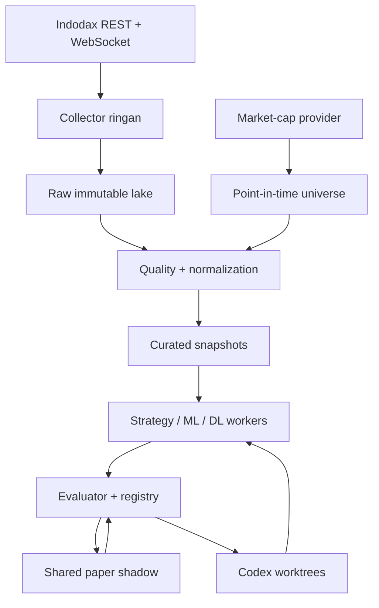
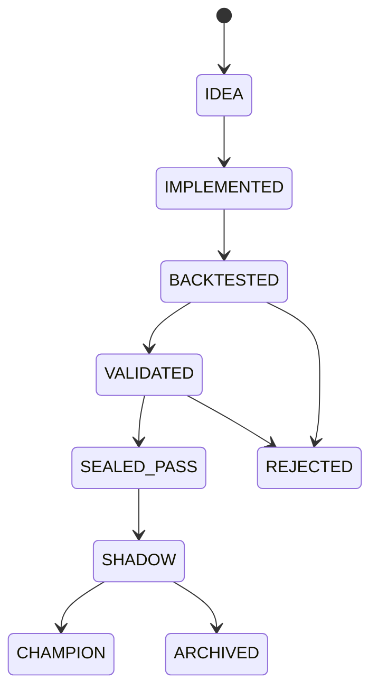
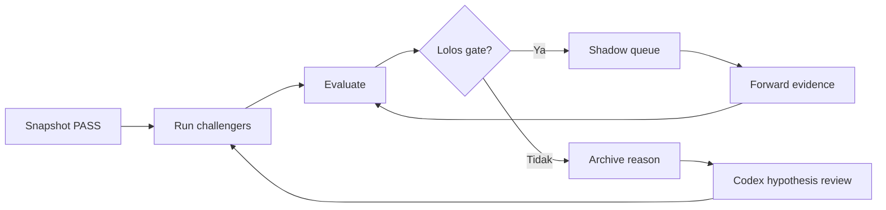

# Indodax Strategy Research Lab — Design Specification

| Metadata | Nilai |
|---|---|
| Versi | 1.1 |
| Status | Implementation-ready draft; paper/shadow only |
| Tanggal | 2026-08-06 |
| Repository | `999aryaDharma/indodax_bot` |
| Baseline | `main@70a9fd611a2db36d5e0b8917498ee47a30d15c47` |
| Audit literatur terakhir | 2026-08-06 |
| Ruang lingkup | Riset, backtest, evaluasi, dan paper/shadow trading; tidak mencakup auto-trading uang nyata |
| Dokumen pendamping | [`dataset-feature-contracts.md`](../../research/dataset-feature-contracts.md) dan [`implementation plan`](../plans/2026-08-06-strategy-research-lab-implementation.md) |

## 1. Ringkasan eksekutif

Dokumen ini merancang evolusi `indodax_bot` dari bot sinyal dengan whitelist statis menjadi **Strategy Research Lab** yang dapat:

1. mengumpulkan dan memvalidasi data Indodax secara terus-menerus;
2. menjalankan banyak strategi big-cap dan small-cap secara terisolasi;
3. membangun baseline klasik, machine learning (ML), dan deep learning (DL);
4. mengevaluasi setiap kandidat dengan biaya dan likuiditas realistis;
5. mengulang siklus riset secara otomatis saat perangkat yang sesuai sedang idle;
6. mempromosikan hanya strategi yang lolos pengujian kronologis dan paper/shadow trading;
7. menggunakan Codex sebagai pembuat dan pengulas *challenger*, bukan sebagai pengambil keputusan trading langsung.
8. membedakan kegagalan teknis, kandidat yang benar-benar buruk, dan kandidat *near miss* agar automasi tidak melakukan tuning tanpa batas.

Prinsip utama sistem adalah **judge before strategy**: data, backtester, model biaya, dan aturan evaluasi harus dipercaya sebelum hasil strategi dipercaya. Sistem tidak menargetkan *win rate* tertentu, tidak menjanjikan profit, dan tidak mengizinkan martingale, averaging-down tanpa batas, atau eksekusi live otomatis.

## 2. Keputusan desain yang mengikat

| Area | Keputusan |
|---|---|
| Mode modal | Setiap strategi mendapat ledger riset virtual Rp500.000; champion juga diuji pada satu ledger bersama Rp500.000 yang realistis. |
| Pasar | Spot IDR/USDT yang tersedia di Indodax, long-only. Strategi pair/relative-value hanya boleh menjadi eksperimen sintetis sampai eksekusinya benar-benar tersedia. |
| Universe | Dinamis dan point-in-time; big-cap/small-cap tidak ditentukan dari harga nominal koin. |
| Validasi | Split kronologis tahunan sebagai tahap pertama; tidak ada random shuffle untuk data time series. |
| Multiple testing | Semua percobaan dicatat. Probability of Backtest Overfitting (PBO) dan Deflated Sharpe Ratio (DSR) digunakan saat jumlah varian sudah memadai. |
| ML/DL | Model kompleks harus mengalahkan baseline sederhana setelah biaya, bukan sekadar memiliki akurasi lebih tinggi. |
| Target model | Prioritas pada return setelah biaya, rank cross-sectional, volatility/quantile, meta-label, dan risk gate; prediksi harga mentah bukan target utama. |
| Kandidat gagal | Run invalid diperbaiki lalu diulang; kandidat valid tetapi buruk diarsipkan; hanya *near miss* dengan hipotesis diagnostik dan budget tersisa yang boleh dituning sebagai versi baru. |
| Tuning | Tuning hanya memakai train + inner validation. Sealed test dan forward paper tidak pernah menjadi objective tuner. Tidak ada loop retry/tuning tanpa batas. |
| Eksekusi | Paper/shadow only. Kunci trade dan withdrawal tidak digunakan. |
| Automasi | Worker sistem menjalankan data/paper loop; Codex menghasilkan riset atau perubahan kode pada worktree/branch terisolasi dan tidak melakukan auto-merge. |
| Sumber data | Endpoint/stream resmi didahulukan. Sumber tidak resmi tidak boleh diam-diam menggantikan data resmi. |
| Reproducibility | Setiap hasil terikat pada Git SHA, dataset snapshot, konfigurasi, seed, dan versi model biaya. |

## 3. Koreksi rentang waktu: mengapa sebelumnya 2023?

**2023 bukan batas maksimum data dan bukan klaim bahwa Indodax hanya menyediakan data sampai/ sejak 2023.** Angka itu berasal dari rancangan eksperimen awal 2023–2025 yang dipakai untuk membagi periode pasar modern. Rentang tiga tahun cukup untuk prototipe strategi klasik, tetapi terlalu pendek untuk klaim kuat—terutama untuk ML/DL.

Kebijakan baru adalah **earliest reliable data**, bukan hard-code tahun 2023:

- target backfill OHLCV/trade dimulai dari 2018-01-01 bila sumber resmi atau dataset yang berlisensi dapat menyediakan data yang lengkap dan dapat diaudit;
- setiap pair memiliki `first_reliable_at`; pair yang listing belakangan tidak diberi data sintetis sebelum listing;
- periode 2023–2025 tetap berguna sebagai holdout modern, bukan seluruh bahan latihan;
- data order book historis tidak boleh direkonstruksi dari candle. Jika arsip order book resmi tidak tersedia, dataset LOB dimulai saat collector dipasang pada 2026 dan bertambah secara forward.

### 3.1 Partisi kronologis awal

| Periode | Peran | Aturan akses |
|---|---|---|
| Earliest reliable–2022-12-31 | Discovery, train, dan riset awal | Boleh dipakai berulang selama seluruh eksperimen tercatat. |
| 2023-01-01–2023-12-31 | Validation | Boleh dipakai untuk memilih keluarga strategi dan rentang parameter. |
| 2024-01-01–2024-12-31 | Sealed gate test | Dibuka sekali untuk versi kandidat yang sudah dibekukan. |
| 2025-01-01–2025-12-31 | Final historical confirmation | Dibuka setelah kandidat lolos gate 2024; tidak boleh dipakai untuk tuning versi yang sama. |
| 2026-01-01–seterusnya | Forward shadow/paper | Hanya informasi yang tersedia pada waktu kejadian yang boleh dipakai. |

Jika kandidat diubah setelah melihat hasil 2024, perubahan tersebut menjadi versi baru: hasil 2024 berubah fungsi menjadi informasi pengembangan, sedangkan 2025 masih dapat menjadi final holdout selama belum pernah dilihat untuk versi baru. Kandidat yang diubah setelah melihat 2025 tidak memiliki historical holdout murni lagi dan harus membuktikan diri melalui forward shadow.

Untuk pair dengan riwayat pendek, split menggunakan tanggal listing dan `first_reliable_at`, tetapi tidak boleh memindahkan data masa depan ke train. Model panel ML/DL boleh menggabungkan banyak pair untuk menambah observasi, tetap dengan pemisahan waktu global.

## 4. Tujuan dan non-tujuan

### 4.1 Tujuan

- Menguji banyak hipotesis strategi dengan biaya komputasi dan data yang terkontrol.
- Membandingkan big-cap dan small-cap secara adil dengan aturan likuiditas berbeda.
- Membuat hasil deterministik, dapat direproduksi, dan dapat diaudit.
- Memisahkan eksperimen independen dari simulasi modal bersama yang realistis.
- Menggunakan ASUS i3/4 GB sebagai collector dan paper runner ringan.
- Menggunakan Lenovo IdeaPad Gaming 3 sebagai backtest/ML/DL worker saat idle dan terhubung ke daya.
- Membuat loop otomatis: ingest → validate → run → evaluate → rank → shadow → repeat.

### 4.2 Non-tujuan

- Auto-trading uang nyata atau penyimpanan API key dengan izin trade/withdrawal.
- Jaminan profit, target *win rate* 85%, atau optimasi tunggal terhadap profit historis.
- Futures, leverage, short-selling, martingale, grid tanpa batas risiko, atau revenge trading.
- LLM yang membaca berita lalu langsung membuka posisi.
- Menganggap harga koin murah sebagai small-cap.
- Menjalankan model DL hanya karena lebih kompleks.
- Menggabungkan output Codex secara otomatis tanpa review dan test.

## 5. Konteks baseline repository

Pada baseline yang ditinjau, repository sudah memiliki bot sinyal Telegram, scheduler, konfirmasi 15 menit, risk gate, dan paper-trading callback. Namun, lab tidak boleh dibangun di atas asumsi berikut sebelum diperbaiki:

1. **Kontradiksi risk/reward bullish.** Stop 1,5 ATR dan target 2,5 ATR menghasilkan reward/risk sekitar 1,67, sedangkan gate minimum meminta 2,0; konfigurasi ini membuat jalur bullish tidak mungkin lolos secara konsisten.
2. **Parser Trade API v2.** Parser perlu mengikuti kontrak resmi v2 (`isBuyer`, `qty`, timestamp milidetik), bukan field/units lama (`type`, `amount`, detik).
3. **Basis biaya paper position.** Fee buy tidak boleh hilang karena kuantitas bersih disimpan sebagai cost basis yang salah; cash, quantity, gross notional, dan fee harus dicatat terpisah.
4. **Selection bias callback.** Hanya mencatat trade yang dipilih pengguna menghasilkan dataset keberhasilan yang bias dan tidak bisa dianggap performa strategi otomatis.
5. **Intrabar TP/SL.** Polling last price dapat melewatkan sentuhan high/low; engine harus memakai candle high/low atau replay tick/order book.
6. **Universe statis.** Whitelist tujuh aset tidak cukup untuk riset big-cap/small-cap point-in-time.
7. **Belum ada judge teruji.** Backtester deterministik, fixtures, data-quality gates, dan regression tests harus dibangun sebelum turnamen strategi dipercaya.

Semua poin tersebut menjadi Phase 0 dan memblokir promosi strategi, tetapi tidak memblokir pengumpulan raw market data.

## 6. Arsitektur sistem



### 6.1 Komponen

| Komponen | Tanggung jawab | Host utama |
|---|---|---|
| `market_collector` | REST backfill, WebSocket trade/order-book capture, reconnect/recovery, checksum | ASUS |
| `data_sentry` | Gap, duplikat, timestamp, OHLC invariants, stale stream, outlier flag | ASUS |
| `universe_builder` | Snapshot cap, volume, spread, depth, listing age, eligibility reason | ASUS/Lenovo |
| `snapshot_builder` | Membentuk dataset immutable dan manifest | ASUS |
| `bar_builder` | Membentuk time bars serta CUSUM/range/volume/dollar bars tanpa mengubah raw event | ASUS/Lenovo |
| `backtest_engine` | Event-driven replay, fill, fee, slippage, ledger, metrics | Lenovo |
| `strategy_workers` | Menjalankan kandidat klasik big-cap/small-cap | Lenovo |
| `ml_worker` | Feature build, train, calibration, inference replay | Lenovo |
| `dl_worker` | ResNet-LSTM/iTransformer/GNN/foundation/LOB experiments dengan idle guard | Lenovo |
| `evaluator` | Gates, PBO/DSR, rank, comparison, promotion state | Lenovo |
| `paper_shadow` | Menjalankan champion/challenger secara forward tanpa order nyata | ASUS |
| `codex_curator` | Mengusulkan hipotesis, code/tests/docs di worktree, membuka draft PR bila diminta | Lenovo |

### 6.2 Batas proses

- Collector, sentry, dan paper engine tidak mengimpor framework training berat.
- Worker tidak menulis ulang raw data; mereka hanya membaca snapshot immutable.
- Evaluator tidak menjalankan strategi; ia hanya mengonsumsi artefak terstandar.
- Codex tidak memiliki kredensial trading dan tidak menulis langsung ke `main`.
- Raw dataset dan model besar tidak disimpan di Git. Git menyimpan kode, konfigurasi, schema, compact reports, dan manifest tanpa data sensitif.

## 7. Layout logis repository

Baseline saat ini memakai modul Python datar di `src/` dan belum memiliki test suite. Implementasi lab dilakukan **secara berdampingan** agar bot sinyal yang berjalan tidak rusak oleh migrasi package besar. Modul lama hanya disentuh untuk perbaikan Phase 0 dan adapter kompatibilitas yang sudah diuji.

```text
configs/
  universe/
  costs/
  features/
  strategies/
  schedules/
docs/
  research/
  superpowers/plans/
  superpowers/specs/
research/
  catalog/
  notebooks/
  reports/
src/
  config.py                 # baseline, dipertahankan sementara
  indodax_api.py            # baseline adapter, diperbaiki di Phase 0
  main.py                   # baseline runtime, tidak dimigrasi sekaligus
  paper_trader.py           # baseline paper adapter
  position_tracker.py       # baseline real-position reader
  risk_manager.py           # baseline risk calculator
  signal_logic.py           # baseline strategies/signals
  ta_processor.py           # baseline technical indicators
  telegram_bot.py           # baseline UI/read-only commands
  indodax_lab/
    contracts/
    cli/
    data/
    features/
    labels/
    universe/
    backtest/
    strategies/
    models/
    evaluation/
    paper/
    orchestration/
tests/
  fixtures/
  unit/
  integration/
  regression/
```

Direktori runtime di luar Git:

```text
lab-data/raw/
lab-data/curated/
lab-data/manifests/
lab-artifacts/runs/
lab-artifacts/models/
lab-artifacts/reports/
```

## 8. Data architecture dan kontrak

### 8.1 Prinsip data

- Raw append-only; koreksi menghasilkan versi baru, bukan overwrite diam-diam.
- Waktu canonical UTC; UI/report boleh menampilkan WITA/WIB secara eksplisit.
- Angka harga/quantity disimpan sebagai decimal atau integer ticks, bukan float biner untuk ledger.
- Setiap row memiliki `source`, `ingested_at`, dan `schema_version`.
- Snapshot diberi `dataset_snapshot_id` berbasis manifest dan checksums.
- REST dan WebSocket harus memakai endpoint/stream resmi yang didokumentasikan.
- Rate limit, syarat penggunaan, dan lisensi provider eksternal dipatuhi.
- Kontrak lengkap tabel, feature registry, label, split, dan contoh row ditetapkan di [`docs/research/dataset-feature-contracts.md`](../../research/dataset-feature-contracts.md); dokumen itu menjadi sumber kebenaran implementasi dataset.

### 8.2 Candle canonical

| Field | Tipe | Ketentuan |
|---|---|---|
| `pair` | string | Canonical internal kompatibel baseline, mis. `btc_idr`; symbol venue `btcidr` disimpan terpisah |
| `interval` | enum | `1m`, `5m`, `15m`, `1h`, `4h`, `1d` yang benar-benar tersedia/diturunkan |
| `open_time` | timestamp UTC | Primary time key |
| `close_time` | timestamp UTC | Eksklusif atau inklusif harus konsisten per schema version |
| `open/high/low/close` | decimal | Wajib memenuhi OHLC invariants |
| `base_volume` | decimal | Volume aset dasar |
| `quote_volume` | decimal nullable | Volume IDR/USDT; dihitung hanya bila definisinya jelas |
| `trade_count` | integer nullable | Tidak diimputasi bila sumber tidak memberi |
| `source` | string | Endpoint/provider identifier |
| `ingested_at` | timestamp UTC | Waktu diterima collector |
| `quality_flags` | array/string | Gap, duplicate, stale, outlier, repaired |
| `schema_version` | integer | Migrasi eksplisit |

### 8.3 Trade dan order book

Trade canonical menyimpan `event_ts`, `pair`, `sequence`, `side`, `price`, `base_qty`, `quote_qty`, `source`, dan `ingested_at`. Order book canonical menyimpan `event_ts`, `pair`, `offset/sequence`, `snapshot_id`, `side`, `level`, `price`, `base_qty`, dan `quote_qty`.

Aturan recovery:

- sequence/offset gap menghentikan status “reliable” sampai snapshot atau recovery berhasil;
- reconnect menggunakan mekanisme recovery offset bila stream mendukung;
- duplikat dide-duplikasi berdasarkan pair + sequence/offset + event identity;
- LOB feature hanya dibuat dari rentang `quality_status=PASS`.

### 8.4 Curated bars dan availability time

Time bars (`1m` sampai `1d`) tetap menjadi baseline. Setelah public trade collector stabil, builder boleh menambah CUSUM-filtered events, range bars, volume bars, dan dollar bars. Setiap bar menyimpan `open_time`, `close_time`, `feature_ready_at`, sumber event, dan quality status. Bar tidak boleh dianggap tersedia sebelum benar-benar tertutup serta melewati latency allowance yang dikonfigurasi.

Informasi-driven bars merupakan *challenger representation*, bukan pengganti otomatis time bars. Keunggulannya harus dinilai pada split dan execution policy yang sama.

### 8.5 Universe snapshot

| Field | Tujuan |
|---|---|
| `as_of_date` | Mencegah survivorship/lookahead bias |
| `asset`, `pair` | Identity |
| `listed_at`, `listing_age_days` | Kelayakan riwayat |
| `market_cap_usd`, `market_cap_rank` | Klasifikasi cap point-in-time bila tersedia |
| `median_quote_volume_30d` | Likuiditas transaksi |
| `median_spread_bps_7d` | Biaya implisit |
| `depth_10bps`, `depth_50bps` | Kapasitas order |
| `zero_volume_ratio_30d` | Kualitas aktivitas |
| `tier` | `BIG_CAP`, `SMALL_CAP`, atau `LIQUIDITY_ONLY` |
| `eligible` | Boolean hasil gate |
| `reason_codes` | Penjelasan include/exclude |
| `source`, `source_ts` | Audit provider |

### 8.6 Run manifest

Setiap run wajib menyimpan:

- `run_id`, `parent_run_id`, `strategy_id`, `strategy_version`;
- `git_sha`, `dirty_worktree=false`, `config_hash`;
- `dataset_snapshot_id`, `universe_snapshot_id`, `split_id`;
- `cost_model_version`, `execution_model_version`;
- `seed`, package lock hash, hardware class;
- waktu mulai/selesai, status, error code;
- lokasi metrics, trades, equity curve, logs, dan model artifact;
- jumlah hipotesis/varian yang telah dicoba pada keluarga strategi.

## 9. Universe big-cap dan small-cap

### 9.1 Definisi

- **Big-cap:** aset dalam kelompok kapitalisasi/rank besar pada tanggal snapshot **dan** lolos likuiditas Indodax.
- **Small-cap:** aset di luar kelompok besar pada tanggal snapshot yang tetap lolos gate likuiditas lebih ketat terhadap ukuran order.
- **Liquidity-only:** market-cap historis tidak tersedia atau tidak dapat diaudit; aset boleh masuk eksperimen likuiditas, tetapi hasil tidak boleh dilabeli big/small-cap.

Provider default market-cap adalah CoinGecko melalui adapter yang menyimpan source timestamp dan raw response sesuai lisensi/quota. Jika point-in-time market cap tidak tersedia, sistem tidak mengisi nilai dari cap hari ini. Klasifikasi turun menjadi `LIQUIDITY_ONLY`.

### 9.2 Default eligibility

Default adalah konfigurasi awal yang akan diuji sensitivitas, bukan kebenaran universal:

| Gate | Big-cap | Small-cap |
|---|---:|---:|
| Listing age | ≥180 hari | ≥180 hari |
| Zero-volume candle ratio 30d | ≤2% | ≤5% |
| Median spread 7d | ≤75 bps | ≤150 bps |
| Depth pada stress band | ≥20× simulated order | ≥10× simulated order |
| Data quality | PASS | PASS |
| Status pair | Aktif dan dapat diperdagangkan | Aktif dan dapat diperdagangkan |

Eligibility dihitung menggunakan data yang tersedia sampai `as_of_date`. Delisted pair tetap ada dalam historical snapshot agar tidak terjadi survivorship bias.

## 10. Strategy catalog

### 10.1 Strategi klasik

| ID | Nama | Inti sinyal | Universe |
|---|---|---|---|
| C01 | Donchian trend breakout | Breakout N-bar + ATR stop + volume gate | Big |
| C02 | EMA trend pullback | Regime EMA panjang, entry pullback EMA pendek | Big |
| C03 | Time-series momentum | Return lookback positif + volatility target | Big |
| C04 | Cross-sectional momentum | Rank return/liquidity, rotasi top-K | Big + liquid small |
| C05 | Volatility breakout | Range expansion setelah kontraksi | Big |
| C06 | ADX/ATR trend | Directional trend dengan strength gate | Big |
| C07 | Bollinger/RSI mean reversion | Deviasi ekstrem dalam regime sideways | Big |
| C08 | Multi-timeframe trend | Trend 4h/1d, trigger 15m/1h | Big |
| C09 | VWAP deviation | Reversion terhadap anchored/rolling VWAP | Big |
| C10 | Regime ensemble | Memilih trend/reversion berdasarkan regime | Big |
| C11 | Volatility-target allocation | Bobot berbanding inverse volatility | Big portfolio |
| C12 | Relative-strength rotation | Rotasi aset terkuat dengan cash gate | Big portfolio |

### 10.2 Strategi small-cap/microstructure

| ID | Nama | Inti sinyal | Guard utama |
|---|---|---|---|
| S01 | Liquidity-screened breakout | Breakout hanya saat spread/depth sehat | Slippage + depth |
| S02 | Squeeze expansion | Bollinger/Keltner squeeze + volume expansion | No-chase cap |
| S03 | Abnormal-volume continuation | Volume z-score + price confirmation | Manipulation filter |
| S04 | Order-flow imbalance | Imbalance LOB/trade untuk horizon pendek | LOB quality |
| S05 | Micro pullback | Pullback singkat dalam impuls likuid | Spread-aware fill |
| S06 | Post-listing maturation | Momentum setelah minimum listing age | No initial listing spike |
| S07 | Small-cap rank rotation | Cross-sectional rank dengan turnover cap | Capacity |
| S08 | Maker mean reversion | Passive quote simulation pada spread lebar | Fill probability |
| S09 | Tail-risk gate | Menghindari pump, gap, dan illiquidity regime | Kill switch |

### 10.3 ML, DL, dan RL research tracks

| ID | Model/pendekatan | Target utama | Status awal |
|---|---|---|---|
| M01 | Logistic/elastic-net terkalibrasi | `P(return_after_cost > 0)` / meta-label | Wave 1 baseline |
| M02 | XGBoost/gradient-boosted trees | Expected return net atau rank | Wave 1 challenger |
| M03 | Random forest | Regime/risk classification | Wave 2 |
| M04 | Regularized/quantile regression | Forward return, volatility, tail quantile | Wave 2 |
| M05 | Calibrated meta-label | Ambil/skip sinyal klasik | Wave 2 |
| M06 | Anomaly detector | Illiquidity/pump/data-risk gate | Wave 2 |
| D01 | Small MLP | Nonlinear tabular baseline | Wave 2 |
| D02 | TCN/1D CNN | Multi-horizon bar sequence | Wave 3 |
| D03 | ResNet-LSTM | Triple-barrier/event-bar classification | Wave 3 challenger |
| D04 | iTransformer compact | Panel multivariate/multi-horizon | Wave 3 challenger |
| G01 | Cross-asset GAT/CryptoGAT-style | Rank/relative return antar-aset | Experimental setelah panel stabil |
| F01 | Kronos finance foundation model | Zero-shot/frozen/fine-tuned K-line forecast | Experimental, provenance-gated |
| L01 | DeepLOB reproduction | Short-horizon LOB movement | Forward LOB baseline |
| L02 | TLOB/LiT-style challenger | Spread-aware LOB target | Forward LOB experimental |
| R01 | Constrained allocation agent | Portfolio weights/cash | Research-only, prioritas terendah |

**Wave 1 wajib:** C01, C02, C03, C04, C07, C10, S01, S02, M01, dan M02. Sepuluh kandidat ini memberi variasi trend, mean-reversion, cross-sectional, small-cap, linear ML, dan tree ML tanpa langsung membebani lab dengan DL.

Audit literatur 2024–2026 tidak mendukung asumsi bahwa model paling baru otomatis paling cocok. Bukti terbaru menunjukkan bahwa (a) simple/tree models sering tetap kuat, (b) mapping prediksi ke eksekusi yang sadar biaya dapat lebih menentukan daripada arsitektur, (c) event bars + Triple Barrier layak diuji, dan (d) cross-asset dependency layak menjadi challenger. Karena itu D03/D04/G01/F01/L02 ditambahkan, tetapi tetap berada di belakang baseline klasik dan tabular.

## 11. Strategy registry dan lifecycle

Setiap strategy version memiliki spesifikasi declarative:

```yaml
strategy_id: C01
version: 1.0.0
family: trend_breakout
universe_tier: BIG_CAP
timeframes: [1h, 4h]
signal_timing: bar_close
execution_timing: next_bar_open
parameters:
  donchian_lookback: 20
  atr_lookback: 14
risk_profile: big_cap_default_v1
allowed_split: annual_v1
status: IDEA
```

Lifecycle:



Promosi hanya dilakukan oleh evaluator berdasarkan policy versioned. Perubahan logic, target, feature, universe, atau parameter setelah sealed test menaikkan strategy version dan mengulang gate yang relevan.

### 11.1 Apa yang terjadi bila hasil satu plan buruk?

Evaluator wajib membedakan status berikut; kata “gagal” tidak cukup sebagai diagnosis:

| Hasil | Contoh | Aksi otomatis |
|---|---|---|
| `INVALID_RUN` | Data gap, parser salah, ledger tidak balance, worker crash | Perbaiki penyebab teknis lalu ulang **konfigurasi yang sama**; hasil tidak masuk ranking. |
| `HARD_FAIL` | Net expectancy negatif, drawdown breach, edge hilang pada biaya base, hasil bergantung pada satu outlier | `REJECTED` dan archive dengan reason code; tidak dituning hanya untuk “mencari profit”. |
| `NEAR_MISS` | Lolos safety, net positive, tetapi satu soft metric sedikit di bawah gate dan hasil stabil lintas fold | Boleh satu tuning round terdaftar pada train/validation jika budget trial masih ada; menghasilkan version baru. |
| `REGIME_EDGE` | Edge konsisten hanya pada regime yang dapat diketahui point-in-time | Buat hipotesis/filter regime baru sebagai challenger version; kandidat lama tetap immutable. |
| `PASS` | Semua hard gate dan evidence gate lolos | Freeze config, buka sealed gate berikutnya, lalu shadow bila lolos. |

Tidak ada mekanisme “hasil buruk → tambah epoch → coba terus”. Pergantian seed tidak boleh dipakai untuk menyulap `HARD_FAIL` menjadi kandidat. Setelah maksimal dua revision rounds per hypothesis family pada dataset snapshot yang sama, keluarga tersebut masuk `COOLDOWN_RESEARCH` sampai ada data baru, bukti baru, atau perubahan hipotesis yang benar-benar material.

### 11.2 Budget tuning dan training default

| Track | Budget awal per model/horizon/snapshot | Early stop / seed | Catatan |
|---|---:|---|---|
| Classical | 24 coarse + 12 refinement trials | Deterministik | Cari plateau, bukan titik optimum tunggal. |
| Logistic/tree | Maks. 30 inner-CV trials | 1 seed saat search; 3 seed untuk finalist stochastic | Objective adalah utility validation net-of-cost + calibration penalty. |
| MLP/TCN/ResNet-LSTM/iTransformer | Maks. 12 configs, 50 epochs/config | Patience 7, simpan best validation checkpoint; finalist 3 seed | Epoch 50 adalah batas, bukan target yang harus dihabiskan. |
| GNN | Maks. 8 configs setelah panel baseline stabil | Patience 7, finalist 3 seed | Adjacency hanya dari train/available-at-time data. |
| Foundation model | Zero-shot → frozen representation/linear probe → adapter fine-tune | Fine-tune hanya bila cutoff pretraining dapat diaudit dan hardware lolos guard | Full fine-tune bukan default. |
| LOB | Maks. 8 configs setelah minimum data gate | Patience 7, chronological folds | DeepLOB/MLP baseline wajib sebelum TLOB/LiT challenger. |
| RL | Tidak masuk scheduler default | Manual research approval | Tidak boleh menggantikan supervised/classical baseline tanpa proyek baru. |

**Retraining** berarti menjalankan recipe/config yang sudah dibekukan pada expanding window baru; ini tidak mengubah hyperparameter. **Tuning/fine-tuning** mengubah parameter model dan selalu membuat challenger/version baru. Champion tetap aktif di shadow sampai challenger melewati gate historis serta forward replacement gate.

## 12. Backtest dan execution model

### 12.1 Pencegahan lookahead

- Sinyal pada close bar dieksekusi paling cepat pada open bar berikutnya.
- Universe hari T hanya menggunakan metadata yang tersedia pada/ sebelum T.
- Feature normalization di-fit pada train dan diaplikasikan ke validation/test.
- Corporate-like events crypto (listing, delisting, redenomination, token swap) dicatat sebagai event, tidak diperbaiki menggunakan informasi masa depan.
- Random split dan shuffled cross-validation dilarang untuk performance claim.

### 12.2 Fill model

Urutan fidelity:

1. replay tick/order book bila tersedia dan berkualitas;
2. candle lower-timeframe;
3. candle strategy-timeframe dengan asumsi konservatif.

Jika TP dan SL tersentuh dalam candle yang sama dan urutannya tidak diketahui, hasil default adalah **SL-first**. Limit order tidak otomatis dianggap maker/fill; simulator memerlukan queue/fill model atau asumsi fill konservatif. Partial fill, min notional, precision, dan insufficient depth harus dapat menghasilkan reject/partial status.

### 12.3 Biaya

- Fee, tax, dan CFX component disimpan dalam tabel `cost_schedule` dengan `valid_from`, `valid_to`, market, side, maker/taker, dan sumber.
- Backtest menggunakan biaya yang berlaku pada event time; satu konstanta untuk semua tahun dilarang bila jadwal berubah.
- Jika jadwal biaya untuk periode tertentu tidak dapat diverifikasi, run boleh berstatus `EXPLORATORY` tetapi tidak dapat dipromosikan.
- Minimum order Indodax Pro dimodelkan Rp25.000 sesuai dokumentasi yang berlaku saat spesifikasi ini dibuat; perubahan berikutnya harus masuk versi cost model baru.

### 12.4 Slippage dan stress

Base slippage diestimasi dari spread/depth aktual bila tersedia. Setiap kandidat juga diuji pada:

- `BASE`: estimasi terukur;
- `STRESS_1_5X`: spread/slippage 1,5 kali base;
- `STRESS_2X`: spread/slippage 2 kali base.

Strategi small-cap yang hanya profit pada fill sempurna tidak dapat dipromosikan. Capacity report menunjukkan dampak untuk simulated notional Rp25k, Rp50k, Rp100k, Rp250k, dan Rp500k tanpa mengasumsikan seluruh modal selalu dapat terisi.

## 13. Modal virtual dan risk policy

### 13.1 Dua jenis ledger

1. **Independent lab ledger:** setiap strategi mulai dari Rp500.000 agar kualitas sinyal dan risk logic dapat dibandingkan tanpa rebutan modal.
2. **Shared champion ledger:** satu akun Rp500.000 mensimulasikan konflik sinyal, cash, min order, korelasi, dan jumlah posisi nyata.

Independent ledger tidak boleh dijumlahkan lalu diklaim sebagai profit yang bisa dicapai dari satu modal Rp500.000.

### 13.2 Default risk profile

| Parameter | Big-cap | Small-cap |
|---|---:|---:|
| Risk per trade | 0,50% equity | 0,25% equity |
| Maksimum risk terbuka per strategy ledger | 1,00% | 0,50% |
| Maksimum alokasi satu aset | 40% equity | 25% equity |
| Shared ledger concurrent positions | 2 total | 2 total |

Portfolio kill switches:

- daily realized + unrealized loss 1,5% → tidak membuka posisi baru sampai hari berikutnya;
- weekly loss 4% → pause dan review otomatis;
- peak-to-trough drawdown 8% → strategy/paper runner halt sampai persetujuan manual;
- data stale, sequence gap, fee unknown, atau spread di atas gate → fail closed;
- tidak ada penambahan size setelah loss di luar sizing rule yang terdaftar.

Karena minimum order Rp25.000 adalah 5% dari modal Rp500.000, sizing engine harus menolak trade bila risk-based size berada di bawah minimum—bukan membulatkannya ke atas dan diam-diam menambah risiko.

## 14. Feature, label, dan model policy

### 14.1 Feature families

- return/momentum multi-horizon;
- **indikator teknikal** yang versioned: EMA/slope, RSI dan StochRSI, MACD, Bollinger position/width, ATR, ADX/+DI/-DI, Donchian, VWAP deviation, dan volume z-score;
- realized volatility, Parkinson/Garman–Klass range volatility, ATR, downside volatility, jump/gap;
- volume, turnover, volume surprise, zero-volume ratio;
- spread, depth, order-flow imbalance, trade imbalance;
- cross-sectional rank dan BTC/market regime;
- calendar features yang diketahui di event time;
- listing age dan liquidity tier.

Indikator teknikal **memang digunakan sebagai feature**, tetapi diperlakukan sebagai transformasi deterministik atas price/volume, bukan “sinyal sakti”. Feature set inti dibatasi untuk menghindari ratusan indikator yang saling duplikat. Setiap feature memiliki formula/library, parameter, lookback, lag availability, dtype, missing policy, dan version. Semua rolling transform dihitung dari bar yang sudah tertutup; scaler, winsorizer, imputasi, dan feature selection hanya di-fit pada train.

On-chain, news, dan sentiment tidak masuk Phase 1 karena timestamp alignment dan licensing risk lebih besar. Jika ditambahkan kemudian, publikasi/ingestion timestamp—bukan tanggal artikel yang diedit—menjadi event time.

### 14.2 Label

- Klasifikasi diarahkan pada probabilitas `forward_return_after_cost > 0`, bukan sekadar up/down sebelum biaya.
- Regression memprediksi return atau quantile pada horizon yang sama dengan execution policy.
- CUSUM/event-bar Triple Barrier menjadi challenger label: barrier baru dimulai setelah harga eksekusi, menyimpan `label_end_ts`, dan memakai purging/embargo yang sesuai.
- Label overlap harus dicatat; sample weight dapat mengoreksi concurrency.
- Cross-sectional model memprediksi rank/relative return pada universe point-in-time, bukan memakai daftar aset hari ini untuk masa lalu.

### 14.3 Baseline hierarchy

Setiap model dibandingkan dengan:

1. cash/no-trade;
2. buy-and-hold yang relevan;
3. naive momentum/mean-reversion;
4. logistic atau regularized linear model;
5. tree model;
6. baru kemudian DL/RL.

Model lebih kompleks hanya dipromosikan bila memberi peningkatan out-of-sample net-of-cost yang stabil, calibration yang layak, dan biaya komputasi/operasional yang masuk akal.

Forecast tidak langsung diubah menjadi trade berdasarkan tanda positif/negatif. Execution mapper menerapkan `expected_edge > estimated_round_trip_cost + safety_margin`, position/risk gate, dan abstain/no-trade zone. Threshold tersebut di-fit hanya pada inner validation lalu dibekukan untuk outer test.

### 14.4 DL, foundation model, dan LOB constraint

DeepLOB/TLOB-style research memerlukan snapshot/order-flow yang kontinu dan berkualitas. Candle OHLCV tidak boleh dipasarkan sebagai pengganti LOB. L01/L02 tetap berstatus `IDEA`, sedangkan run-nya berstatus `BLOCKED_DATA`, sampai tersedia sekurang-kurangnya 90 hari data LOB PASS dan cukup event pada beberapa regime; kelayakan final ditentukan oleh effective sample size dan coverage, bukan hanya jumlah row.

Kronos/F01 diperlakukan sebagai external pretrained artifact. Manifest wajib menyimpan model revision, checksum, license, declared pretraining cutoff/sources, inference mode, dan kemungkinan overlap dengan evaluation period. Jika cutoff atau corpus tidak dapat diaudit, hasil hanya `EXPLORATORY`; evaluasi utama menggunakan data Indodax yang benar-benar terjadi setelah cutoff dan, idealnya, setelah model release untuk mengurangi contamination/memorization risk.

G01 membentuk graph hanya dari informasi yang tersedia sampai decision time. Hubungan berbasis full-sample correlation, full-history similarity, atau future universe dilarang.

## 15. Evaluation framework

### 15.1 Metrics wajib

- net return dan CAGR/annualized return bila durasi memadai;
- Sharpe, Sortino, Calmar, max drawdown, time under water;
- profit factor, expectancy, payoff ratio, win rate;
- turnover, exposure, trade frequency, average holding time;
- fee/slippage share of gross edge;
- worst day/week/month, losing streak, tail loss;
- capacity/depth utilization;
- per-year, per-regime, per-tier, dan per-asset breakdown;
- ML: log loss/Brier, calibration, precision-recall, rank IC, dan trading utility net of cost.

Win rate tidak pernah dipakai sendirian. Strategi dengan win rate rendah dan payoff besar dapat valid; strategi dengan win rate tinggi tetapi tail loss fatal harus gagal.

### 15.2 Minimum evidence

- Sedikitnya 100 closed trades pooled untuk klaim awal, dengan minimal 20 per regime penting bila regime tersebut ada.
- Positive expectancy dan profit factor >1 setelah base cost.
- Tetap tidak negatif secara material pada `STRESS_1_5X`; kegagalan pada `STRESS_2X` dilaporkan sebagai limit kapasitas.
- Parameter berada pada plateau yang stabil, bukan satu titik optimum tajam.
- Tidak ada satu aset atau satu bulan yang menyumbang lebih dari 50% total net profit tanpa justifikasi risiko yang kuat.
- Max drawdown sesuai risk budget dan tidak berasal dari accounting artifact.

Angka di atas adalah promotion defaults; evaluator menyimpan policy version agar perubahan gate tidak mengubah hasil lama secara diam-diam.

### 15.3 Multiple testing

- Semua trial, termasuk gagal, disimpan dalam experiment registry.
- DSR dihitung untuk mengoreksi non-normality dan selection bias saat membandingkan banyak trial.
- PBO/CSCV dihitung per keluarga strategi setelah tersedia cukup konfigurasi dan blok waktu untuk estimasi yang bermakna.
- Wave 1 menggunakan split tahunan sederhana yang telah ditentukan; walk-forward yang lebih kompleks menjadi stress test lanjutan, bukan alasan untuk terus mengutak-atik holdout.

### 15.4 Promotion score

Leaderboard menampilkan metrics mentah dan satu score untuk sorting, tetapi promosi memakai hard gates. Score awal:

```text
robust_score =
  0.25 * normalized_net_expectancy
  + 0.20 * normalized_sortino
  + 0.15 * normalized_calmar
  + 0.15 * cost_stress_resilience
  + 0.10 * regime_consistency
  + 0.10 * parameter_stability
  + 0.05 * capacity_score
```

Score tidak boleh menutupi gate failure seperti lookahead, data gap, drawdown breach, atau fee unknown.

## 16. Background automation

### 16.1 Job graph

| Job | Trigger/cadence | Resource class | Output |
|---|---|---|---|
| `data_sentry` | Continuously + daily report | LOW | Quality status, gap queue |
| `bar_feature_build` | Setelah raw partition final | LOW/MEDIUM | Curated bars + versioned features |
| `universe_refresh` | Daily after market snapshot | LOW | Universe snapshot |
| `classic_big_worker` | Nightly/idle | MEDIUM | C-series run artifacts |
| `classic_small_worker` | Nightly/idle | MEDIUM | S-series run artifacts |
| `ml_worker` | Weekly + new dataset snapshot | HIGH | M-series models/runs |
| `dl_worker` | Idle + AC power + explicit queue | GPU/HIGH | D-series models/runs |
| `evaluator` | After successful run batch | MEDIUM | Gates, leaderboard, reports |
| `paper_shadow` | Every eligible market event | LOW | Forward ledger/events |
| `codex_curator` | Twice weekly/manual | MEDIUM | Hypothesis/design/code draft branch |
| `maintenance` | Weekly | LOW | Retention, checksum, stale worktree report |

### 16.2 Concurrency dan queue

- Satu writer per raw partition dan satu writer per experiment registry transaction.
- Backtest workers boleh paralel hanya pada output directory/run ID berbeda.
- ASUS menjalankan maksimum collector + sentry + paper runner ringan; tidak menjalankan training.
- Lenovo default satu HIGH job atau dua MEDIUM jobs bersamaan.
- DL job hanya mulai jika perangkat terhubung AC, idle ≥10 menit, free RAM ≥4 GB, suhu/GPU dalam batas aman, dan tidak ada interactive workload.
- Job yang terinterupsi menulis checkpoint atomic dan dapat resume; partial output tidak boleh diberi status success.

### 16.3 Peran Codex

Codex scheduled/background task dipakai untuk pekerjaan repository seperti:

- merangkum hasil run dan mengusulkan hipotesis berikutnya;
- membuat implementation candidate beserta tests pada worktree terisolasi;
- membandingkan hasil dengan acceptance criteria;
- menyiapkan draft PR untuk review.

Codex bukan scheduler market-critical. Collector dan paper engine menggunakan systemd/APScheduler yang tetap berjalan tanpa UI. Untuk task lokal Codex, komputer harus hidup dan aplikasi Codex berjalan; task dijalankan unattended dengan sandbox/permissions yang sempit. Prompt harus diuji manual sebelum dijadwalkan, dan worktree lama dibersihkan berkala.

### 16.4 Siklus otomatis



Loop tidak mengubah rule candidate yang sedang diuji. Challenger baru selalu versioned dan tidak menggantikan champion sampai promotion gate lengkap.

`Archive reason` bukan selalu umpan untuk mencoba ulang. Hanya `INVALID_RUN` masuk retry queue otomatis. `NEAR_MISS` masuk hypothesis-review queue dan tetap tunduk pada trial/revision budget. `HARD_FAIL` ditutup; scheduler tidak membuka kembali kandidat itu hanya karena mesin sedang idle.

## 17. Fault handling dan observability

### 17.1 Status standar

`PENDING`, `RUNNING`, `SUCCESS`, `FAILED_RETRYABLE`, `FAILED_FINAL`, `BLOCKED_DATA`, `BLOCKED_POLICY`, `CANCELLED`, `STALE`.

### 17.2 Fail-closed conditions

- stale market data melebihi dua interval;
- WebSocket gap belum recovered;
- timestamp bergerak mundur;
- OHLC invariant rusak;
- fee/cost schedule tidak diketahui;
- universe snapshot hilang;
- model artifact/config hash tidak cocok;
- available cash atau position quantity tidak konsisten dengan double-entry ledger.

### 17.3 Monitoring

- structured JSON logs dengan `run_id`, `pair`, dan error code;
- heartbeat collector/paper runner;
- queue depth, run duration, retry count, disk use, data freshness;
- daily Telegram summary tanpa secrets atau raw exception yang sensitif;
- alert hanya setelah dedup/cooldown agar bot tidak spam.

Retention default: raw market data dipertahankan; verbose logs 30 hari; checkpoints gagal 14 hari; model artifact yang kalah dapat dipindah ke cold/archive setelah manifest dan metrics disimpan.

## 18. Testing dan verification

### 18.1 Unit tests

- indicator alignment dan warmup;
- risk/reward math dan sizing terhadap min order;
- fee buy/sell, partial fill, realized/unrealized PnL;
- parser REST/Trade API v2 dan timestamp units;
- universe eligibility point-in-time;
- split chronology, purging/embargo bila dipakai;
- deterministic seed/config hashing.

### 18.2 Golden fixtures

- tiny candle sequence dengan entry/TP/SL yang hasilnya dihitung manual;
- same-bar TP+SL yang harus menghasilkan SL-first;
- fee schedule berubah di tengah periode;
- delisted pair tetap muncul di historical universe;
- WebSocket duplicate/gap/recovery sequence;
- paper ledger round-trip buy → partial sell → final sell.

### 18.3 Property/invariant tests

- cash + marked position − fees = equity;
- quantity tidak negatif pada spot long-only;
- high ≥ max(open, close), low ≤ min(open, close), high ≥ low;
- feature/label timestamp tidak melewati decision timestamp;
- hasil run identik untuk snapshot/config/seed/Git SHA yang sama;
- peningkatan fee/slippage tidak boleh meningkatkan PnL untuk trade path yang sama.

### 18.4 Integration dan regression

- sandbox/replayed official API fixtures → raw → curated → backtest → metrics;
- one-day paper replay end-to-end;
- golden leaderboard untuk mendeteksi perubahan engine;
- resource smoke test pada ASUS profile dan Lenovo profile;
- restart/recovery test tanpa duplicate orders/events.

## 19. Security dan governance

- API key collector adalah public/read-only bila autentikasi tidak diperlukan; account reconciliation memakai key tanpa withdrawal dan tanpa trade selama scope paper-only.
- Telegram `chat_id` menggunakan allowlist; administrative commands memerlukan owner identity.
- Secrets hanya dari environment/secret store, tidak di Git, artifact, prompt Codex, atau logs.
- Raw API payload yang mengandung account identifiers dipisahkan dari research dataset.
- Branch protection/review manusia diperlukan sebelum merge ke `main`.
- Codex task memakai least privilege, repository scope sempit, dan tidak menerima secret trading.
- Aktivasi live trading merupakan proyek dan persetujuan baru; dokumen ini tidak memberi otorisasi tersebut.

## 20. Rollout bertahap

### Phase 0 — Trust the base

- Perbaiki kontradiksi RR, Trade API v2 parser, fee/cost basis, intrabar logic, dan callback selection accounting.
- Bangun ledger, fixtures, dan deterministic execution tests.
- Mulai raw WebSocket trade/order-book collection segera agar LOB history bertambah.

**Exit:** semua P0 regression/golden tests pass dan paper ledger balance dapat direkonsiliasi.

### Phase 1 — Data + classical judge

- Raw/curated lake, manifest, data sentry, dynamic universe, feature registry v1, dan time bars.
- Backtester event-driven dan cost schedule versioning.
- C01, C02, C03, C04, C07, C10, S01, S02.

**Exit:** delapan strategi klasik dapat dijalankan reproducibly pada annual split dan cost stress.

### Phase 2 — ML baselines + tournament

- M01 logistic/elastic-net, M02 gradient boosting.
- Cost-aware abstain/execution mapper, walk-forward training, calibration, dan model artifact contract.
- CUSUM/information-driven bars + Triple Barrier sebagai challenger terhadap time-bar labels.
- Experiment registry, leaderboard, DSR, PBO bila sample trial memadai.
- Independent dan shared Rp500k ledgers.

**Exit:** model ML dibandingkan dengan baseline klasik pada holdout dan tidak ada leakage.

### Phase 3 — Forward paper + selective DL

- Paper champion/challenger, portfolio risk gates, 90-day forward evidence.
- D01–D04 hanya setelah ML baseline stabil; G01 dan F01 setelah provenance/panel gate; L01/L02 setelah LOB dataset layak.

**Exit:** kandidat champion bertahan sekurang-kurangnya 90 hari dan 100 pooled closed trades forward, mana yang lebih lama, tanpa policy breach.

### Phase 4 — Codex research automation

- Prompt templates diuji manual.
- Scheduled/worktree tasks membuat challenger dan reports secara unattended.
- Draft PR, review, cleanup, dan resource budgets diterapkan.

**Exit:** minimal dua siklus otomatis selesai tanpa menyentuh `main`, tanpa secret exposure, dan dengan artefak reproducible.

## 21. Acceptance criteria sistem

Sistem desain ini dianggap terimplementasi ketika:

1. semua data yang dipakai memiliki snapshot ID, lineage, dan quality status;
2. universe bersifat point-in-time dan tidak memakai cap hari ini untuk masa lalu;
3. backtest tidak memiliki known lookahead serta lolos golden/property tests;
4. fee, tax, spread, slippage, min order, dan partial fill tercermin dalam ledger;
5. Wave 1 lengkap dan setiap run reproducible dari manifest;
6. yearly split dari earliest reliable (target 2018 bila tersedia) sampai 2025 dijalankan sesuai aturan akses holdout;
7. semua trial, termasuk gagal, masuk registry dan multiple-testing report;
8. shared ledger benar-benar membatasi total modal ke Rp500.000;
9. background workers dapat resume dan fail closed saat data/policy invalid;
10. Codex hanya menghasilkan branch/worktree/draft review output dan tidak bisa trade/merge sendiri;
11. DL tidak dipromosikan tanpa mengalahkan baseline net-of-cost;
12. candidate lifecycle membedakan invalid, hard fail, near miss, dan pass serta menegakkan tuning budget;
13. technical indicators yang digunakan tercatat dalam feature registry dan lolos availability/leakage tests;
14. tidak ada live trading tanpa proyek, threat review, dan persetujuan baru.

## 22. Keputusan yang sengaja ditunda

Hal berikut tidak memblokir implementasi awal dan memiliki default aman:

- **Vendor market-cap berbayar:** default CoinGecko adapter; jika historical point-in-time tidak tersedia, gunakan `LIQUIDITY_ONLY`, bukan data buatan.
- **Cloud storage:** default local Parquet + DuckDB; transfer snapshot ke Lenovo melalui SSH/rsync dengan checksums. Cloud baru dipilih jika volume/backup menuntutnya.
- **Framework experiment tracking:** default manifest JSON/YAML + DuckDB, bukan service berat.
- **GPU stack:** dipilih setelah deteksi hardware Lenovo; CPU baseline tetap wajib.
- **Live execution:** di luar scope dan default tetap nonaktif.

## 23. Referensi primer dan resmi

### Indodax

- [Official Indodax API and Streams documentation](https://github.com/btcid/indodax-official-api-docs)
- [Public REST API](https://github.com/btcid/indodax-official-api-docs/blob/master/Public-RestAPI.md)
- [Market Data WebSocket](https://github.com/btcid/indodax-official-api-docs/blob/master/Marketdata-websocket.md)
- [Indodax Trade API 2.0](https://github.com/btcid/indodax-official-api-docs/blob/master/INDODAX-TradeAPI-2.md)
- [Indodax transaction fees and minimum order](https://help.indodax.com/hc/en-us/articles/4416646599705-Details-of-Transaction-Fees-on-INDODAX)
- [Indodax limit, market, and stop-limit order behavior](https://help.indodax.com/hc/en-us/articles/13348121502361-What-are-Limit-Order-Market-Order-and-Stop-Limit-Order)

### Evaluation dan research methods

- Bailey et al., [The Probability of Backtest Overfitting](https://papers.ssrn.com/sol3/papers.cfm?abstract_id=2326253)
- Bailey & López de Prado, [The Deflated Sharpe Ratio](https://papers.ssrn.com/sol3/papers.cfm?abstract_id=2460551)
- Cakici et al. (2024, peer reviewed), [Machine learning and the cross-section of cryptocurrency returns](https://doi.org/10.1016/j.irfa.2024.103244)
- Grądzki et al. (2025, peer reviewed), [Algorithmic crypto trading using information-driven bars, triple barrier labeling and deep learning](https://doi.org/10.1186/s40854-025-00866-w)
- Bysik & Ślepaczuk (2026, preprint), [Machine Learning-Based Bitcoin Trading Under Transaction Costs](https://arxiv.org/abs/2606.00060)
- Peng et al. (2026, preprint), [CryptoGAT: Are Time Series Models Effective for Cryptocurrency Forecasting?](https://arxiv.org/abs/2606.27670)
- Shi et al. (2025, preprint), [Kronos: A Foundation Model for the Language of Financial Markets](https://arxiv.org/abs/2508.02739)
- Meyer et al. (2025, preprint), [Time Series Foundation Models: Benchmarking Challenges and Requirements](https://arxiv.org/abs/2510.13654)
- Zhang, Zohren & Roberts, [DeepLOB](https://arxiv.org/abs/1808.03668)
- Berti & Kasneci (2025, preprint), [TLOB: A Novel Transformer Model with Dual Attention](https://arxiv.org/abs/2502.15757)

Referensi model terbaru di atas adalah sumber ide dan benchmark, bukan bukti langsung bahwa model akan profit pada Indodax. Perbedaan venue, spot long-only, pair IDR, biaya, spread, kedalaman, dan modal Rp500.000 tetap harus diuji lokal.

### Codex background work

- [OpenAI: Scheduled tasks](https://learn.chatgpt.com/docs/automations)

## 24. Review gate

Dokumen ini tetap menjadi **design specification**. Urutan file, test, migrasi, dan checkpoint konkret berada di implementation plan pendamping. Dokumen-dokumen ini tidak mengaktifkan automation, paper runner baru, atau live execution; perubahan runtime hanya terjadi ketika task implementasi dikerjakan, direview, dan diverifikasi secara terpisah.
